# formation-pose

A student reproduction of **"Vision-Based Precision Pose Estimation for Autonomous
Formation Flying"** (Punnoose, Stanford).

A follower aircraft carries a gimballed camera that always points at a leader aircraft.
The goal is to estimate the leader's relative pose (position + attitude) from the pixel
locations of 14 keypoints on the leader. Like the paper, we assume a perfect keypoint
detector and use purely synthetic data.

The project is built in 6 phases; this repository currently contains Phases 1 to 4b.

## Setup

```bash
python3 -m venv .venv
source .venv/bin/activate
pip install -r requirements.txt
```

## Phase 1: simulation and dataset generation

| File | Purpose |
|------|---------|
| `config.py` | Conventions, camera intrinsics, keypoints, occlusion shapes, label grid |
| `geometry.py` | Pose -> camera transform, pinhole projection, occlusion (the only pose-to-pixel code) |
| `simulator.py` | Random pose sampling and the approach trajectory used in later phases |
| `dataset.py` | Features, labels, dataset generation CLI, sample plot |
| `test_phase1.py` | Sanity checks (prints PASS/FAIL) |

Run:

```bash
python test_phase1.py
python dataset.py                 # 100k train + 20k val -> data/*.npz
python dataset.py --noise_px 1.0  # same, with 1 px Gaussian keypoint noise
python dataset.py --gimbal_noise_deg 0.5  # same, with gimbal pointing error
```

This writes `data/train.npz` and `data/val.npz` (keys `X`, `y`, `poses`) and
`results/sample_keypoints.png`.

- **Pose**: `[x, y, z, roll, pitch, yaw]` - follower position relative to the leader
  (metres, leader body axes, x forward / y right / z down) and leader attitude relative
  to the follower (degrees, ZYX Euler). See the docstring in `config.py`.
- **Features**: 45 numbers. 42 keypoint features, `(u, v, visible)` per keypoint, with
  `u, v` normalised about the image centre (hidden keypoints are zeroed), plus 3 numbers
  for the gimbal direction: the unit vector from the follower to the leader in follower
  body axes (`geometry.boresight_unit`). The gimbal centres the leader in the image, so
  the pixel features alone lose the viewing direction, which a real gimbal knows. A 3D
  unit vector is used rather than azimuth/elevation because azimuth wraps at +/-180 deg
  when the leader is behind the follower. `config.GIMBAL_NOISE_DEG` (default 0) can
  perturb it for later phases.
- **Labels**: nearest point of the paper's Table I grid over x, y, z and roll
  (10 x 10 x 8 x 6 = 4800 classes).

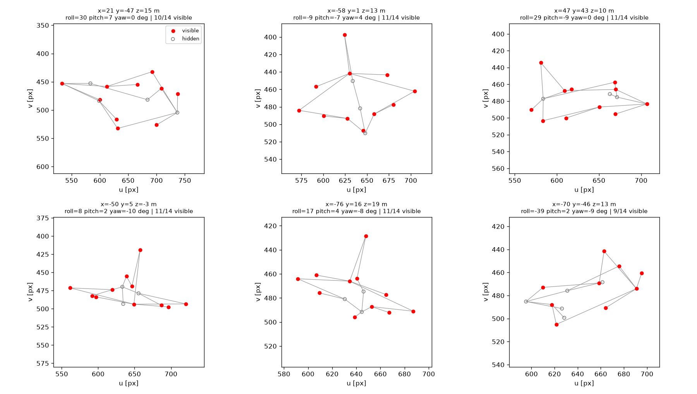

### Simplifications

- The 14 keypoints are an approximate F-16 layout, not measured from a real model.
- Occlusion uses a simple fuselage ellipsoid plus two flat wing triangles; the tail,
  canopy and stores do not occlude anything.
- Pitch and yaw are sampled (+/-10 deg) but are not part of the classification label.

## Phase 2: pose classifier

Implements the paper's classifier (Section IV-D): an MLP that maps the features to one of
the 4800 grid cells. Its output is the coarse pose used to start the particle filter in
Phase 3.

| File | Purpose |
|------|---------|
| `classifier.py` | Model, training, evaluation, figures, and the API below |
| `test_phase2.py` | Sanity checks (prints PASS/FAIL) |
| `models/classifier.pt` | Trained weights (tracked in git, about 2 MB) |
| `models/error_samples.npy` | (true pose - predicted bin pose) for every validation sample, shape (20000, 6); used by the particle filter in Phase 3 |

Run (needs `data/*.npz` from Phase 1):

```bash
python classifier.py
python test_phase2.py
```

Later phases use `load_model()`, `predict_probs(model, X)`, `predict_label(model, X)`
and `predict_pose(model, X)`.

**Architecture**: 45 -> 100 (ReLU) -> 100 (ReLU) -> 4800, softmax / cross-entropy.
Adam, lr 1e-3, batch size 256, up to 40 epochs on `data/train.npz`, best checkpoint by
validation accuracy, early stopping after 5 epochs without improvement. The model
standardises its input with the training-set mean and std (stored with the weights).

### Results (20,000 validation samples)

| Metric | Ours | Paper |
|--------|------|-------|
| Top-1 accuracy | 59.2 % | 54 % |
| Top-5 accuracy | 95.5 % | - |
| Neighbour accuracy (within one grid step in x, y, z, roll) | 99.9 % | - |
| Mean abs. error x / y / z | 4.59 / 3.16 / 1.63 m | - |
| Mean abs. error roll | 4.82 deg | - |

Errors are between the predicted bin's pose and the true pose. Raw numbers are in
`results/classifier_metrics.json`.

Predicted bin pose minus true pose: mostly discretisation error.

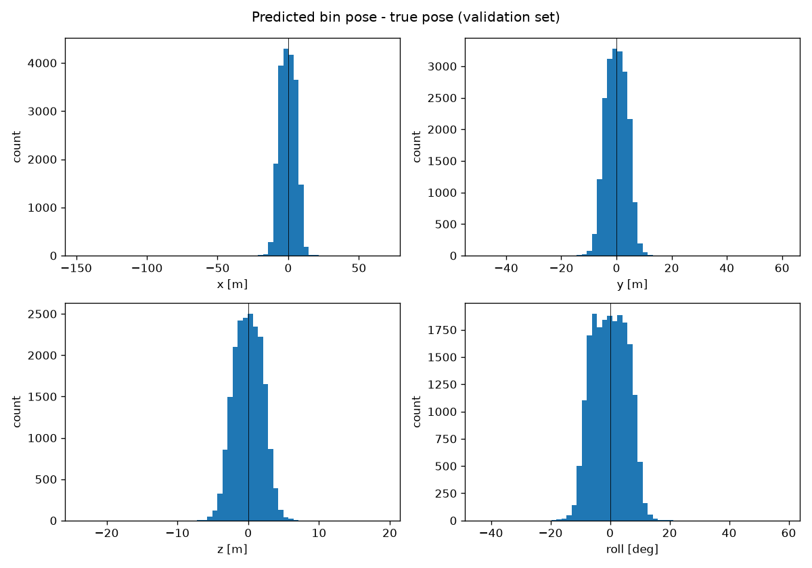

Predicted bin pose minus correct bin pose: a tall spike at zero plus small bars for
adjacent-bin mistakes.

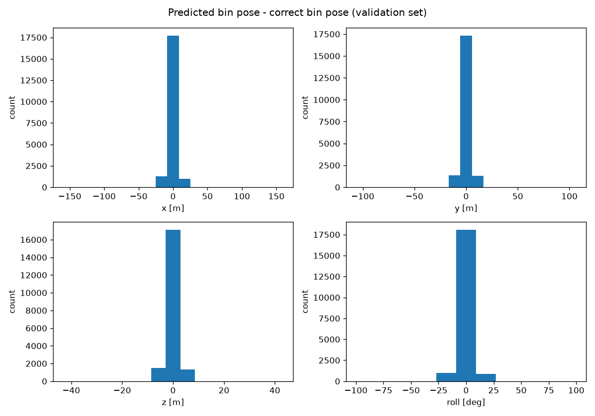

Training curve: `results/training_curve.png`.

### Design note: why the gimbal direction is an input

The first version used only the 42 keypoint features and reached just 16.0 % top-1. The
gimbal always centres the leader, so the pixels do not contain the viewing direction, and
the random +/-10 deg pitch and yaw look like a change of viewing direction. A real gimbal
knows where it points, so the classifier now also gets that direction (45 features).
Diagnostic runs with the same architecture and training recipe:

| Features | Pitch / yaw | Top-1 | Top-5 | Neighbour |
|----------|-------------|-------|-------|-----------|
| 42 (original) | +/-10 deg | 16.0 % | 52.2 % | 71.6 % |
| 42 | 0 | 60.2 % | 94.9 % | 98.5 % |
| **45 (used)** | +/-10 deg | 59.2 % | 95.5 % | 99.9 % |
| 45 | 0 | 65.1 % | 97.3 % | 100.0 % |

The 45-feature, +/-10 deg row is the final model. Pitch and yaw stay at +/-10 deg in the
actual design because the later phases must handle them.

## Phase 3: baseline particle filter

A faithful implementation of the paper's particle filter (Section IV-E), **without any
improvements** (those are Phases 4-5). It is meant as a fair reproduction, including the
paper's weaknesses.

| File | Purpose |
|------|---------|
| `filters.py` | `ParticleFilter`, observations, alpha schedules, `run_filter` |
| `geometry.py` | `project_points_batch`: vectorised projection of many particles |
| `run_phase3.py` | Experiments and figures |
| `test_phase3.py` | Sanity checks (prints PASS/FAIL) |
| `results/pf_baseline_metrics.json` | Numbers in the table below |

```bash
python test_phase3.py
python run_phase3.py     # about 6 s for everything
```

### Algorithm

Particle state `[x, y, z, roll, pitch, yaw, vx, vy, vz]` (pose as in `config.py`, relative velocity in m/s).

1. **Initialise**: the classifier's pose for the first observation plus random rows of
   `models/error_samples.npy` (its validation errors). Velocities uniform in +/-5 m/s.
2. **Propagate** every step (dt = 0.1 s): position += velocity * dt, velocity += uniform
   random acceleration in +/-`A_MAX` (2 m/s^2) * dt, roll/pitch/yaw += uniform random rate
   in +/-`W_MAX` (20 deg/s) * dt.
3. **Weights**: `w_i = 1 / (MSE_i + eps)`, where MSE_i is the mean squared pixel error between
   the observed visible keypoints and particle i's projection (`eps` = 1e-3 px^2, `PF_EPS`),
   then normalised. With fewer than 3 visible keypoints the weights are not updated.
4. **Estimate** (before resampling): weighted mean of position and velocity; weighted mean
   of attitude with `scipy Rotation.mean`.
5. **Resample**: `floor(alpha * N)` particles by systematic resampling; the other
   `N - floor(alpha * N)` are drawn fresh from the *current* classifier prediction plus
   random error samples, with the current weighted mean velocity. `alpha` follows a
   schedule (alpha = 1 is plain resampling).

### Our simplifications

- **Constant-velocity dynamics.** The paper treats the leader's unknown controls as a
  random disturbance but does not fully specify the dynamics, so this is our own
  constant-velocity approximation with uniform random accelerations and attitude rates.
- **No occlusion for particles** (as in the paper, it is too expensive): only keypoints that
  are visible in the actual observation are compared.
- **Measured boresight.** The gimbal points at the *true* leader and its direction is known.
  Particles are projected with that measured boresight, not with their own direction to
  their own leader; otherwise every particle would put the leader at the image centre and
  the weights could not tell them apart.
- `eps`, the velocity range and when the weights are skipped are our choices; the paper
  gives no values.

### Results

Approach trajectory, no keypoint noise, 5 seeds (mean +/- std over seeds of the
time-averaged error). The classifier-only estimate is deterministic. Attitude error is the
geodesic angle between the true and estimated rotations.

| Method | Position error [m] | Attitude error [deg] | Runtime [ms/step] |
|--------|-------------------|----------------------|-------------------|
| Classifier only | 7.05 | 5.03 | - |
| Config A (N = 1000, alpha = 0.9 every 10th step) | 10.27 +/- 2.67 | 8.73 +/- 0.69 | 1.8 |
| Config B (N = 5000, alpha = 0.9 every step) | 4.91 +/- 1.14 | 5.19 +/- 0.55 | 8.5 |

Errors over time (seed 0):

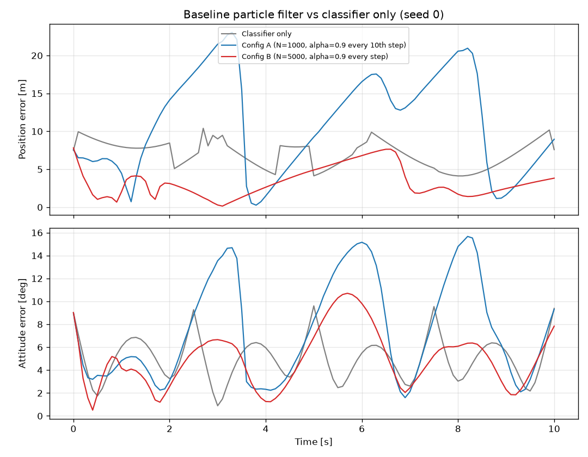

True vs estimated position, Config B (seed 0):

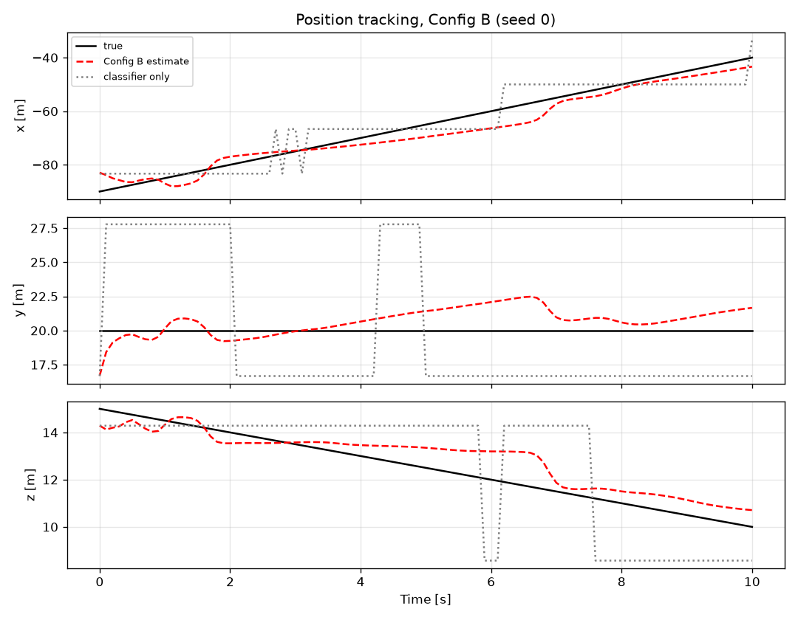

### Comparison with the paper

Like the paper, the baseline filter does **not** clearly beat the classifier. Config A is
*worse* than the classifier alone in both position and attitude: with only 1000 particles and
fresh classifier particles on just every 10th step, the cloud drifts away from the truth
between refreshes (the error grows, then drops when the particles are replaced). Config B
reduces the mean position error (4.9 m vs 7.1 m, with a large spread between seeds), but its
attitude error is no better than the classifier's, and it needs about 5x the particles.
Neither configuration gets near an accurate estimate, which is the weakness Phases 4-5
address. Only the trends should be compared with the paper: our keypoints, camera and
occlusion model differ from the paper's, and the dynamics are our approximation.

## Phase 4: PnP refinement

Three single-frame estimators, compared on the same noisy keypoints (the classifier is the
Phase 2 model, not retrained, and sees the noisy features):

1. **Classifier only**: the grid-cell pose from Phase 2.
2. **PnP only**: `cv2.solvePnP(..., flags=cv2.SOLVEPNP_SQPNP)`, no initial guess, no classifier.
3. **Classifier + PnP** (our improvement): the classifier's pose, converted to `rvec/tvec`, is
   the initial guess for `cv2.solvePnP(..., useExtrinsicGuess=True, flags=SOLVEPNP_ITERATIVE)`,
   followed by `cv2.solvePnPRefineLM`.

| File | Purpose |
|------|---------|
| `pnp.py` | `pnp_only(obs)`, `classifier_pnp(obs, coarse_pose)` |
| `geometry.py` | added `camera_to_pose` (inverse of `pose_to_camera`); `pose_to_camera` got an optional `boresight` argument |
| `run_phase4.py` | Experiments, tables, figures |
| `test_phase4.py` | Sanity checks (prints PASS/FAIL) |
| `results/pnp_metrics.json` | All numbers |

```bash
python test_phase4.py
python run_phase4.py
```

### Details

- Only keypoints that are visible in the observation are used, with `config.KEYPOINTS` and `config.K`.
- **Why at least 4 points**: each keypoint gives 2 equations (u, v) and a pose has 6 unknowns, so 3
  points are the mathematical minimum, but 3 points give up to 4 solutions. We require 4 (as
  OpenCV's iterative solver needs) and treat fewer as "no solution".
- **Camera frame to pose**: PnP returns the leader in the *camera* frame. `camera_to_pose` rotates
  it into the follower frame using the *measured* boresight (the gimbal direction), not the
  estimate. For the initial guess, `pose_to_camera(coarse_pose, boresight)` also uses the measured
  boresight, so the guess is consistent with how the image was formed.
- **Fallback**: if fewer than 4 keypoints are visible or the solver fails, `classifier_pnp` returns
  the coarse pose and sets `info["fallback"] = True`; `pnp_only` returns `None`.
- **Plausibility**: a solution is rejected if the leader is behind the camera (`t_cam` z <= 0) or the
  range is outside [10, 300] m (failure for PnP only, fallback for classifier + PnP).
- `info` holds the number of visible keypoints, the reprojection RMSE in px
  (sqrt of the mean squared 2D distance) and whether it fell back.
- **Metrics**: position error (m), attitude error (geodesic angle, deg), mean and median. A frame is
  a *failure* if there is no solution or position > 10 m or attitude > 20 deg. Runtime of
  classifier + PnP includes the classifier call. In the trajectory experiment, PnP-only frames
  with no solution would be left out of the error averages (and counted); there were none.
  Gross errors are kept in the means.

### Experiments

1. **Approach trajectory** (`simulator.approach_trajectory`, 101 steps), noise 0, 1, 2, 5 px, 5 seeds
   each, plus Phase 3 Config B (N = 5000, alpha = 0.9) as the reference. The observations are
   identical for all methods.
2. **Random poses**: 2000 poses per noise level (seed 12345; training uses 0, validation 1),
   split by number of visible keypoints.

### Results: approach trajectory

Mean +/- std over 5 seeds of the time-averaged error; "med" is the median over frames.

| Noise | Method | Pos mean [m] | Pos med [m] | Att mean [deg] | Att med [deg] | Fail % | ms/frame |
|------|--------|-------------|------------|---------------|--------------|--------|----------|
| 0 px | Classifier only | 7.05 | 7.52 | 5.03 | 4.96 | 2.0 | 0.05 |
| | PnP only | 0.00 | 0.00 | 0.00 | 0.00 | 0.0 | 0.08 |
| | Classifier + PnP | 0.00 | 0.00 | 0.00 | 0.00 | 0.0 | 0.21 |
| | Phase 3 Config B | 4.91 +/- 1.14 | 4.68 | 5.19 +/- 0.55 | 4.64 | 6.7 | 8.9 |
| 1 px | Classifier only | 7.19 +/- 0.05 | 7.64 | 5.14 +/- 0.07 | 4.96 | 6.3 | 0.05 |
| | PnP only | 0.44 +/- 0.02 | 0.32 | 0.75 +/- 0.04 | 0.72 | 0.0 | 0.08 |
| | Classifier + PnP | 0.43 +/- 0.02 | 0.31 | 0.74 +/- 0.04 | 0.72 | 0.0 | 0.22 |
| | Phase 3 Config B | 6.77 +/- 0.83 | 6.47 | 5.90 +/- 0.26 | 5.18 | 18.6 | 9.0 |
| 2 px | Classifier only | 7.26 +/- 0.11 | 7.49 | 5.24 +/- 0.12 | 4.98 | 9.1 | 0.05 |
| | PnP only | 0.89 +/- 0.05 | 0.64 | 1.50 +/- 0.08 | 1.45 | 0.0 | 0.09 |
| | Classifier + PnP | 0.87 +/- 0.04 | 0.63 | 1.49 +/- 0.08 | 1.44 | 0.0 | 0.23 |
| | Phase 3 Config B | 6.35 +/- 1.03 | 6.07 | 6.20 +/- 0.20 | 5.64 | 13.3 | 9.1 |
| 5 px | Classifier only | 8.08 +/- 0.23 | 7.86 | 5.77 +/- 0.19 | 5.19 | 22.0 | 0.05 |
| | PnP only | 2.76 +/- 0.14 | 1.94 | 4.35 +/- 0.63 | 3.66 | 1.2 | 0.09 |
| | Classifier + PnP | 2.17 +/- 0.10 | 1.60 | 3.72 +/- 0.20 | 3.56 | 0.8 | 0.22 |
| | Phase 3 Config B | 7.91 +/- 0.43 | 7.70 | 7.45 +/- 0.46 | 7.12 | 30.7 | 9.1 |

Errors over time at 2 px (seed 0):

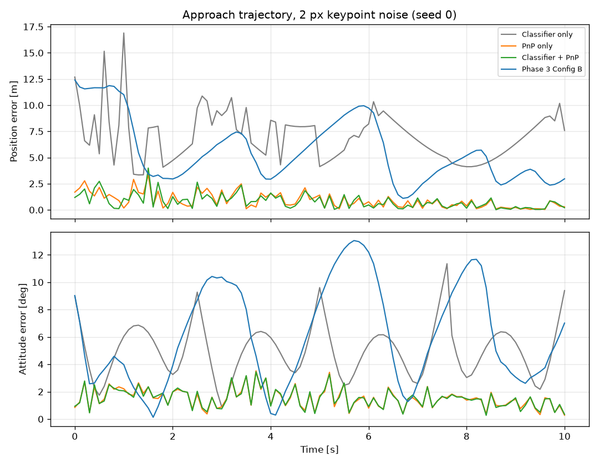

Error vs noise level:

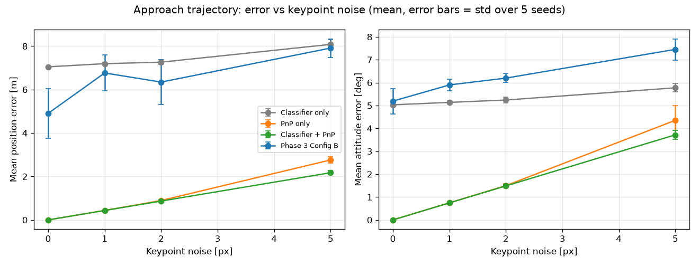

### Results: random poses (2000 per noise level)

| Noise | Visible | n | Method | Pos mean / med [m] | Att mean / med [deg] | Fail % | Fallback % |
|------|---------|---|--------|-------------------|---------------------|--------|-----------|
| 2 px | all | 2000 | Classifier only | 6.73 / 6.47 | 9.62 / 9.76 | 12.6 | - |
| | | | PnP only | 0.71 / 0.41 | 1.37 / 1.23 | 0.0 | - |
| | | | Classifier + PnP | 0.68 / 0.41 | 1.37 / 1.22 | 0.0 | 0.0 |
| | 7-9 | 399 | Classifier only | 6.50 / 6.31 | 9.61 / 9.78 | 9.5 | - |
| | | | PnP only | 0.51 / 0.30 | 1.47 / 1.37 | 0.0 | - |
| | | | Classifier + PnP | 0.50 / 0.30 | 1.47 / 1.35 | 0.0 | 0.0 |
| | 10-14 | 1601 | Classifier only | 6.78 / 6.54 | 9.62 / 9.75 | 13.3 | - |
| | | | PnP only | 0.76 / 0.45 | 1.35 / 1.18 | 0.0 | - |
| | | | Classifier + PnP | 0.73 / 0.44 | 1.34 / 1.17 | 0.0 | 0.0 |
| 5 px | all | 2000 | Classifier only | 7.65 / 6.99 | 9.95 / 9.98 | 20.5 | - |
| | | | PnP only | 2.17 / 1.14 | 3.60 / 3.06 | 2.4 | - |
| | | | Classifier + PnP | 1.90 / 0.99 | 3.38 / 2.98 | 1.1 | 0.1 |
| | 7-9 | 399 | Classifier only | 7.33 / 6.82 | 9.87 / 9.87 | 17.0 | - |
| | | | PnP only | 1.45 / 0.82 | 3.88 / 3.15 | 0.8 | - |
| | | | Classifier + PnP | 1.22 / 0.78 | 3.46 / 3.05 | 0.0 | 0.0 |
| | 10-14 | 1601 | Classifier only | 7.73 / 7.04 | 9.97 / 10.01 | 21.4 | - |
| | | | PnP only | 2.35 / 1.24 | 3.53 / 2.99 | 2.8 | - |
| | | | Classifier + PnP | 2.07 / 1.07 | 3.36 / 2.97 | 1.3 | 0.2 |

The 0 px and 1 px tables are in the script output and `results/pnp_metrics.json`.
**The requested 4-6 group is empty**: with our occlusion model no random pose (and no trajectory
frame) has fewer than 8 visible keypoints, so the benchmark says nothing about few-keypoint cases.

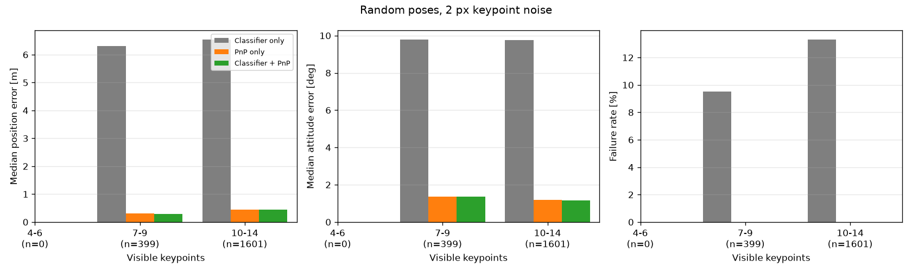

### What this shows

- **Zero-noise PnP is near-exact (about 1e-10 m) because the keypoints are ideal.** That is expected
  and not a result; the noise sweep and visibility breakdown are the meaningful parts.
- **Both PnP methods are far better than the classifier alone and than the Phase 3 particle filter**
  (about 0.9 m / 1.5 deg vs 7 m / 5 deg at 2 px), at a fraction of the cost of the filter.
- **Does the classifier add anything over pure geometry?** Very little in these experiments.
  Up to 2 px, classifier + PnP and PnP only agree to within a few percent; sometimes PnP only is
  fractionally better (for example the median position error at 2 px over all random poses,
  0.4129 vs 0.4131 m), which is a tie. SQPnP finds the global solution without any guess, so a good
  starting point is not needed when 8 or more keypoints are visible.
- **At 5 px the classifier helps modestly**: on the trajectory, position 2.17 vs 2.76 m (-21 %),
  attitude 3.72 vs 4.35 deg (-14 %, with a much smaller spread across seeds), and gross failures
  0.8 % vs 1.2 %. On random poses, 1.90 vs 2.17 m, and 1.1 % vs 2.4 % failures. The coarse pose
  steers the iterative solver away from the occasional wrong PnP solution when the noise is large.
- **What is not tested here**: the few-keypoint regime (4-6 visible), where a global solver and a
  guess-based solver could differ most. The 4-6 column of the benchmark is empty, so we make no claim
  about it.
- The classifier still provides a coarse pose when PnP cannot run (fewer than 4 visible keypoints;
  this is what the fallback returns) and a prior for a filter, which is Phase 5.

## Phase 4b: hybrid PnP and keypoint dropout

Phase 4 could not test few-keypoint cases (no random pose has fewer than 8 visible keypoints),
and a quick check suggested the classifier hurt there. This phase tests it properly.

| File | Purpose |
|------|---------|
| `pnp.py` | added `hybrid_pnp(obs, coarse_pose)`; `classifier_pnp` is unchanged |
| `train_dropout.py` | trains `models/classifier_dropout.pt` (same architecture and settings; 0-6 extra visible keypoints hidden per sample, re-drawn every batch). `models/classifier.pt` is untouched |
| `run_phase4b.py` | dropout sweep, figure and metrics |
| `results/pnp_dropout.png`, `pnp_dropout_metrics.json`, `classifier_dropout_metrics.json` | outputs |

```bash
python train_dropout.py
python run_phase4b.py
```

- **Hybrid**: runs SQPnP (no guess) and classifier-initialised PnP, keeps the plausible solution with
  the lower reprojection RMSE, and returns the coarse pose only if both fail.
- **Classifier accuracy (top-1, validation)**:

| Model | Normal validation | Validation with random dropout (0-6 hidden) |
|-------|------|------|
| Original | 59.2 % | 18.3 % |
| Dropout-trained | 56.3 % | 52.5 % |

  The dropout model gives up about 3 points on normal data and is far better when keypoints are missing.
  (The dropout model trained for all 40 epochs without early stopping.)
- **Sweep**: 2000 random poses, noise 2 and 5 px, 5 seeds. Extra keypoints are hidden so that about
  4-6, 7-9 or 10+ stay visible (a random target in the range; keypoints are never added, so the 10+
  group only uses poses that really have at least 10 visible), and the classifier features are
  rebuilt from the reduced set. Cells are mean over seeds; "pos" in m, "att" in deg, shown as mean / median.
  Gross failure = no solution, position > 10 m or attitude > 20 deg.

| Noise | Visible | Method | Pos mean / med | Att mean / med | Fail % | Fallback % |
|------|------|--------|------|------|------|------|
| 2 px | 4-6 | PnP only | 1.45 / 0.73 | 5.44 / 2.14 | 2.8 | 0.0 |
|  |  | Classifier + PnP (orig clf) | 5.71 / 0.73 | 4.46 / 2.18 | 5.8 | 4.7 |
|  |  | Classifier + PnP (dropout clf) | 1.35 / 0.70 | 2.64 / 2.11 | 0.8 | 0.0 |
|  |  | Hybrid (dropout clf) | 1.37 / 0.70 | 3.99 / 2.12 | 1.7 | 0.0 |
|  | 7-9 | PnP only | 0.89 / 0.48 | 1.66 / 1.45 | 0.0 | 0.0 |
|  |  | Classifier + PnP (orig clf) | 5.58 / 0.49 | 2.94 / 1.47 | 4.3 | 4.3 |
|  |  | Classifier + PnP (dropout clf) | 0.87 / 0.48 | 1.65 / 1.44 | 0.0 | 0.0 |
|  |  | Hybrid (dropout clf) | 0.87 / 0.48 | 1.65 / 1.44 | 0.0 | 0.0 |
|  | 10+ | PnP only | 0.80 / 0.44 | 1.37 / 1.21 | 0.0 | 0.0 |
|  |  | Classifier + PnP (orig clf) | 1.31 / 0.43 | 1.53 / 1.20 | 0.5 | 0.5 |
|  |  | Classifier + PnP (dropout clf) | 0.80 / 0.43 | 1.37 / 1.20 | 0.0 | 0.0 |
|  |  | Hybrid (dropout clf) | 0.77 / 0.43 | 1.37 / 1.20 | 0.0 | 0.0 |
| 5 px | 4-6 | PnP only | 3.67 / 1.94 | 13.98 / 5.55 | 14.4 | 0.0 |
|  |  | Classifier + PnP (orig clf) | 7.53 / 1.89 | 8.43 / 5.55 | 13.1 | 4.8 |
|  |  | Classifier + PnP (dropout clf) | 3.35 / 1.79 | 6.80 / 5.36 | 8.7 | 0.0 |
|  |  | Hybrid (dropout clf) | 3.39 / 1.82 | 11.46 / 5.46 | 11.8 | 0.0 |
|  | 7-9 | PnP only | 2.50 / 1.30 | 4.87 / 3.63 | 4.2 | 0.0 |
|  |  | Classifier + PnP (orig clf) | 6.96 / 1.23 | 5.27 / 3.66 | 6.6 | 4.5 |
|  |  | Classifier + PnP (dropout clf) | 2.17 / 1.18 | 4.11 / 3.58 | 2.3 | 0.0 |
|  |  | Hybrid (dropout clf) | 2.14 / 1.18 | 4.37 / 3.58 | 2.5 | 0.0 |
|  | 10+ | PnP only | 2.35 / 1.30 | 3.49 / 2.98 | 2.7 | 0.0 |
|  |  | Classifier + PnP (orig clf) | 2.59 / 1.10 | 3.58 / 2.96 | 1.6 | 0.6 |
|  |  | Classifier + PnP (dropout clf) | 1.90 / 1.10 | 3.37 / 2.95 | 1.0 | 0.0 |
|  |  | Hybrid (dropout clf) | 1.88 / 1.10 | 3.37 / 2.95 | 1.0 | 0.0 |

Classifier-only numbers and no-solution counts are in `results/pnp_dropout_metrics.json`.

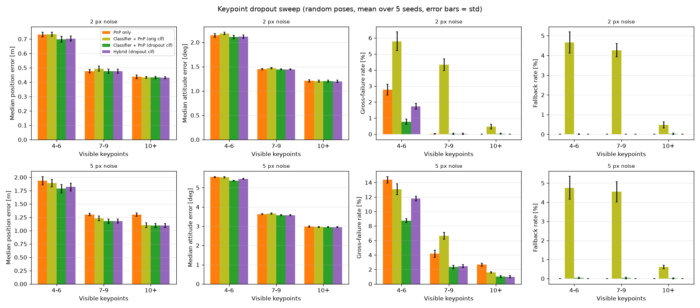

### Conclusion

- **The Phase 4 hint was a training-distribution problem, not a PnP problem.** With the original
  classifier, classifier + PnP falls back to the coarse pose on about 4-5 % of frames when keypoints
  are dropped (even at 7-9 visible), giving mean position errors of 5-6 m. With the dropout-trained
  classifier the fallback rate is about 0.
- **Medians barely change between methods** (all within a few percent): for typical frames,
  PnP-only is already as accurate as anything else.
- **The classifier helps in the tails.** With the dropout-trained classifier, classifier + PnP has the
  lowest (or tied-lowest) gross-failure rate in every cell except 10+ visible at 2 px, where failures are
  ~0 for every method (PnP-only and the hybrid 0.0 %, classifier + PnP 0.02 %): at 4-6 visible, 0.8 % vs 2.8 % for PnP-only at 2 px and
  8.7 % vs 14.4 % at 5 px, and it halves the mean attitude error at 4-6 / 2 px (2.64 vs 5.44 deg). The gain
  shrinks as more keypoints are visible and noise is low, and is zero in the median.
- **The hybrid did not beat classifier + PnP (dropout clf).** It is equal or marginally better at 7+
  visible, but worse at 4-6 visible (attitude mean 3.99 vs 2.64 deg and 1.7 % vs 0.8 % failures at
  2 px), though still better than PnP-only. Choosing the solution with the lowest reprojection
  error does not choose the one closest to the truth: with few noisy points, the wrong pose
  can fit the pixels equally well, and the classifier's pose is the better tie-breaker. The hybrid's
  advantage is robustness to a bad classifier (it is the safe choice with the original model).
- **Summary**: the classifier is useful only as an initial guess that has seen missing keypoints, and
  then it mainly removes occasional gross errors; it does not improve typical accuracy. These are
  simulated, ideal-detector results (our occlusion model, Gaussian noise only).

## Phase 5: filtering on top of PnP

Two filters that use the PnP pose as their measurement, compared with the Phase 3 baseline
particle filter (untouched) and with single-frame PnP.

| File | Purpose |
|------|---------|
| `filters.py` | added `KalmanFilter`, `ImprovedParticleFilter`, `PnPOnly`, `pnp_measurement`, `calibrate_pnp_noise`; `run_filter` got an optional `outage` argument (default behaviour unchanged) |
| `run_phase5.py` | calibration, experiments A and B, figures, metrics |
| `run_phase5_ablation.py` | the likelihood / particle-source ablation table in the Discussion |
| `test_phase5.py` | sanity checks (prints PASS/FAIL) |
| `results/kf_noise_calibration.json`, `filter_metrics.json` | calibrated R and all numbers |
| `results/filter_errors_2px.png`, `filter_noise_sweep.png`, `filter_outage.png`, `filter_trajectory.png` | figures |

```bash
python test_phase5.py
python run_phase5.py     # about 50 s
```

### The PnP measurement

`hybrid_pnp` (Phase 4b) started from the **original** classifier (the same one the Phase 3 filter uses).
If fewer than 4 keypoints are visible, or both solvers fail and the hybrid falls back to the coarse
classifier pose, there is no measurement (a coarse pose is not trusted as a measurement).

### Kalman filter

- **State (12):** `[x, y, z, vx, vy, vz, roll, pitch, yaw, roll_rate, pitch_rate, yaw_rate]`,
  constant velocity for both position and angles, linear. Angle innovations are wrapped to [-180, 180).
- **Q:** discrete white-noise-acceleration model, per axis with state `[p, v]`:
  `Q = sigma_a^2 [[dt^4/4, dt^3/2], [dt^3/2, dt^2]]`. The Phase 3 filter uses a uniform random
  acceleration in +/-`A_MAX`, whose std is `A_MAX / sqrt(3)`, so `sigma_a = A_MAX / sqrt(3)` for position
  and `W_MAX / sqrt(3)` deg/s^2 for the angles (we read `W_MAX` as how fast the rate can change
  per second: our interpretation, since in Phase 3 it is a rate, not an acceleration).
- **R (calibration):** `calibrate_pnp_noise` runs the PnP measurement on 1000 random poses (seed 424242,
  used nowhere else) at each noise level and takes the 6x6 error covariance. Position errors are divided by
  `range / 65 m` first, so one covariance describes the reference range; at run time the position
  variances are scaled by `(range / 65)^2` using the range of the measurement. Frames with no solution
  or a gross failure (position > 10 m or attitude > 20 deg, the Phase 4 definition) are left out of
  the calibration (11 of 1000 at 5 px, none otherwise), because the gate handles those at run
  time. A floor of 0.01 m / 0.01 deg std is added so that R is invertible at 0 px.
  Calibrated std at 65 m (x, y, z in m; roll, pitch, yaw in deg):

| Noise | x | y | z | roll | pitch | yaw |
|-------|------|------|------|------|------|------|
| 0 px (floor) | 0.010 | 0.010 | 0.010 | 0.010 | 0.010 | 0.010 |
| 1 px | 0.390 | 0.211 | 0.092 | 0.526 | 0.388 | 0.456 |
| 2 px | 0.781 | 0.423 | 0.183 | 1.052 | 0.777 | 0.913 |
| 5 px | 1.797 | 1.004 | 0.443 | 2.636 | 1.938 | 2.278 |

- **Initialisation:** from the first PnP measurement, velocities and rates zero, with std 5 m/s
  (`V_INIT_MAX`) and 20 deg/s (`W_MAX`) as the initial uncertainty.
- **Gating:** the update is skipped if the squared Mahalanobis distance of the innovation exceeds 22.46
  (chi-squared 99.9 %, 6 dof); the rejections are counted. With no measurement or a rejected one the
  filter only predicts.

### Improved particle filter

Same as the Phase 3 filter (dynamics, measured boresight, systematic resampling), with these changes only:
Gaussian likelihood `w_i ~ exp(-SSE_i / (2 sigma^2))`, `sigma = max(noise_px, 1)` px, SSE over the
visible keypoints in log space; initial and fresh particles are drawn from `N(PnP pose, R)` instead of the
classifier bin plus error samples; N = 1000, alpha = 0.9 every step. During an outage there is no PnP pose, so the
"fresh" 10 % are copied from the current cloud (plain resampling).

### Experiments

Approach trajectory, noise 0, 1, 2, 5 px, 5 seeds (each method sees the same observations for a given
seed). **A**: normal. **B**: all keypoints hidden for 4.0 <= t < 5.0 s (10 steps); single-frame PnP has no
output there. Cells are the mean over seeds of the per-run statistic (the standard deviations are in
`results/filter_metrics.json`). "Gated" = Kalman updates rejected per run (101 steps).

**Experiment A (normal run)**

| Noise | Method | Pos mean / med [m] | Att mean / med [deg] | Gated | ms/step |
|------|--------|------|------|------|------|
| 0 px | Phase 3 PF (Config B) | 4.91 / 4.68 | 5.19 / 4.64 | - | 8.5 |
|  | PnP alone | 0.00 / 0.00 | 0.00 / 0.00 | - | 0.3 |
|  | Improved PF | 0.58 / 0.58 | 0.50 / 0.46 | - | 2.1 |
|  | Kalman filter | 0.00 / 0.00 | 0.00 / 0.00 | 0.0 | 0.3 |
| 1 px | Phase 3 PF (Config B) | 6.77 / 6.47 | 5.90 / 5.18 | - | 8.5 |
|  | PnP alone | 0.43 / 0.31 | 0.74 / 0.72 | - | 0.3 |
|  | Improved PF | 0.75 / 0.70 | 1.10 / 1.06 | - | 2.1 |
|  | Kalman filter | 0.23 / 0.16 | 0.75 / 0.70 | 2.2 | 0.3 |
| 2 px | Phase 3 PF (Config B) | 6.35 / 6.07 | 6.20 / 5.64 | - | 8.5 |
|  | PnP alone | 0.87 / 0.63 | 1.49 / 1.44 | - | 0.3 |
|  | Improved PF | 1.18 / 1.05 | 1.56 / 1.47 | - | 2.1 |
|  | Kalman filter | 0.43 / 0.30 | 1.50 / 1.43 | 2.4 | 0.3 |
| 5 px | Phase 3 PF (Config B) | 7.91 / 7.70 | 7.45 / 7.12 | - | 8.5 |
|  | PnP alone | 2.17 / 1.60 | 3.72 / 3.56 | - | 0.3 |
|  | Improved PF | 2.13 / 1.76 | 3.08 / 2.88 | - | 2.1 |
|  | Kalman filter | 1.07 / 0.82 | 3.67 / 3.70 | 3.2 | 0.4 |

(Runtimes include the classifier and PnP calls for every method except the baseline.)

**Experiment B (outage 4.0-5.0 s; "after" = 5.0-6.0 s), mean errors**

| Noise | Method | Pos in outage [m] | Att in outage [deg] | Pos after [m] | Att after [deg] | Gated |
|------|--------|------|------|------|------|------|
| 0 px | Phase 3 PF (Config B) | 9.42 | 10.50 | 6.54 | 9.02 | - |
|  | PnP alone | missing (10 steps) | missing | 0.00 | 0.00 | - |
|  | Improved PF | 2.70 | 5.97 | 0.95 | 1.25 | - |
|  | Kalman filter | 0.00 | 4.10 | 0.00 | 0.00 | 0.0 |
| 1 px | Phase 3 PF (Config B) | 9.09 | 10.45 | 7.64 | 8.42 | - |
|  | PnP alone | missing | missing | 0.42 | 0.72 | - |
|  | Improved PF | 3.68 | 6.16 | 1.41 | 1.96 | - |
|  | Kalman filter | 0.48 | 8.67 | 0.75 | 28.34 | 26.6 |
| 2 px | Phase 3 PF (Config B) | 9.24 | 10.46 | 8.93 | 9.58 | - |
|  | PnP alone | missing | missing | 0.84 | 1.45 | - |
|  | Improved PF | 3.17 | 6.37 | 1.54 | 2.10 | - |
|  | Kalman filter | 0.82 | 11.51 | 1.24 | 35.08 | 28.2 |
| 5 px | Phase 3 PF (Config B) | 9.33 | 12.17 | 10.30 | 10.56 | - |
|  | PnP alone | missing | missing | 2.10 | 3.65 | - |
|  | Improved PF | 2.95 | 6.57 | 3.07 | 3.75 | - |
|  | Kalman filter | 2.20 | 16.24 | 3.03 | 45.59 | 21.0 |

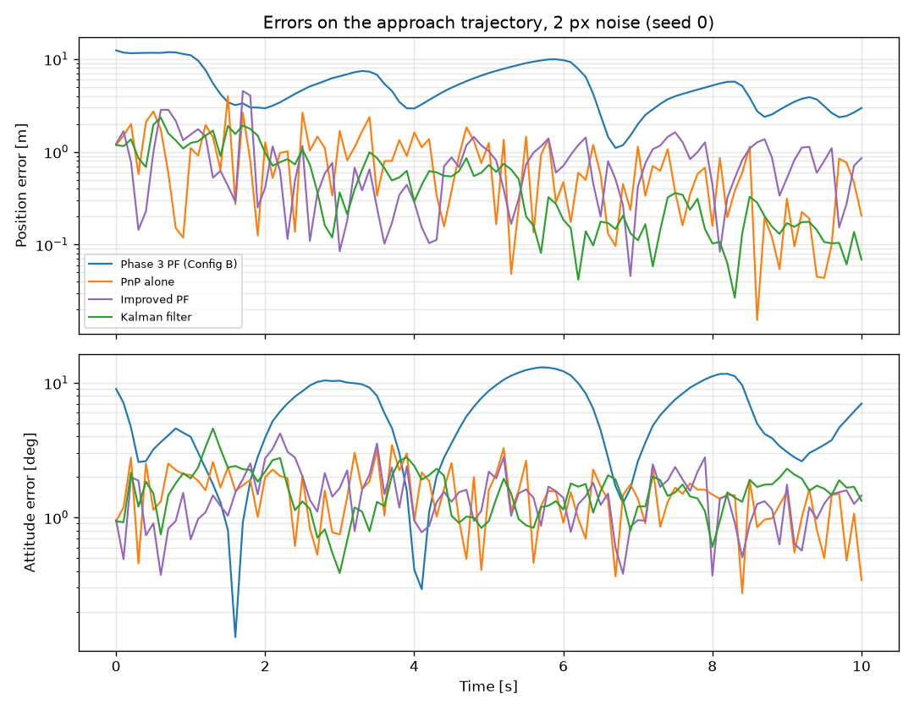
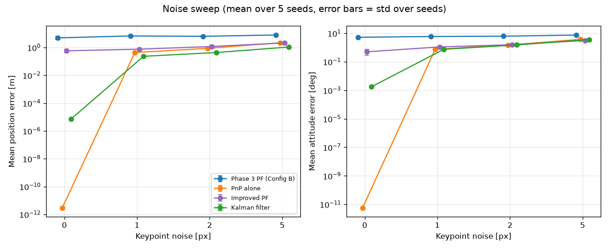
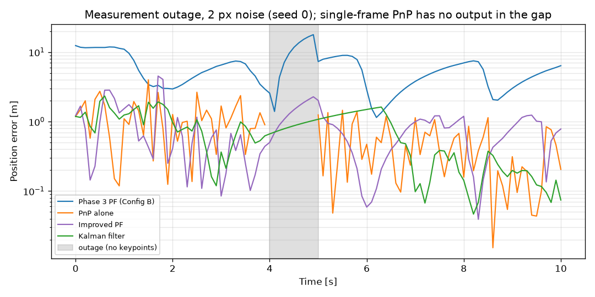
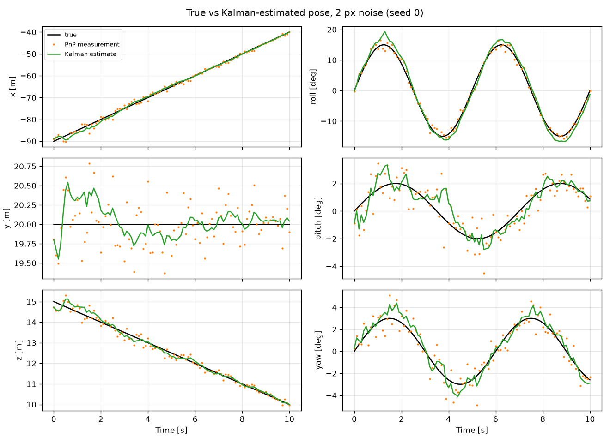

### Discussion

**Where filtering helps.**
- *Position under noise.* With 1-5 px noise the Kalman filter roughly halves the position error of
  single-frame PnP (0.43 vs 0.87 m at 2 px, 1.07 vs 2.17 m at 5 px). Position moves almost at constant
  velocity, which is exactly what the model assumes, so averaging over time pays off.
- *Outages.* The Kalman filter keeps a position estimate through the gap (0.5-2.2 m, similar to or better than
  PnP's own noise level) where single-frame PnP has nothing.

**Where it does not.**
- *Zero noise.* The Kalman filter equals PnP (0.00 m): nothing to average, and with R at its floor it simply follows
  the measurement without visible lag. The improved particle filter is *worse* than PnP at 0 px
  (0.58 m vs 0.00) and also at 1-2 px (1.18 vs 0.87 m at 2 px): it only approximates the posterior
  with 1000 samples, and its random-rate dynamics add scatter that a single PnP solve does not have.
- *Attitude.* The Kalman filter's attitude error is the same as PnP's (1.50 vs 1.49 deg at 2 px, 3.67 vs 3.72 at
  5 px). The roll swings +/-15 deg in 5 s, so the constant-rate model lags as much as smoothing gains.
- *After an outage the Kalman filter fails badly in attitude* (28-46 deg mean over the following second at
  noise > 0). The cause, checked step by step for seed 0 at 2 px: the roll rate estimated before the gap
  (-6.9 deg/s) is wrong for the next second (the true rate swings to +15), so the extrapolated roll
  is 24 deg off at t = 5 s, about 6 standard deviations of the predicted covariance. The gate then
  rejects 14 consecutive *good* measurements (a gate lock-out, which is why the gated counts are 21-28 per run), while
  the roll error drifts to -47 deg, until the covariance has grown enough at t = 6.4 s. Position is fine because it really is near constant velocity.
  This is a consequence of the specified design (white-noise-acceleration Q from `A_MAX`/`W_MAX`, hard gate), not
  tuned or fixed here. Typical remedies, which we did not apply: re-initialise after N consecutive rejections, or
  inflate the angular Q.
- *The gate rejects 2-3 % of normal measurements* (nominal 0.1 %). Measured on fresh random poses at 2 px,
  3 % of PnP errors exceed the gate under the calibrated R. The reason is that depth error grows faster
  than linearly with range: the position std rescaled to 65 m is 0.45 m for ranges of 25-50 m, 0.77 m (50-75),
  1.17 m (75-100) and 1.59 m (100-150), whereas the specified `(range / 65)^2` variance scaling assumes it is
  constant. At the far end of the trajectory R is therefore too small.
- *The single-frame PnP beats the filters* in these cases: attitude at 0-2 px (equal or marginally better than
  the Kalman filter, clearly better than the improved PF), position at 0-2 px against the improved PF, and everything after the outage
  against the Kalman filter's attitude.

**Improved vs Phase 3 baseline particle filter.** The improved filter is far better (1.2 vs 6.4 m and 1.6 vs 6.2 deg at
2 px) and approaches PnP quality, but it is not better than PnP itself except for attitude at 5 px
(3.08 vs 3.72 deg). Its two changes were made together, so to see which matters we ran an ablation
(N = 1000, alpha = 0.9 every step, 5 seeds, mean position [m] / attitude [deg]; reproduce with
`python run_phase5_ablation.py`, which needs `results/kf_noise_calibration.json` from `run_phase5.py`):

| Likelihood / particle source | 0 px | 2 px | 5 px |
|------|------|------|------|
| 1/(MSE+eps) + classifier (baseline design, N = 1000) | 5.82 / 6.36 | 7.80 / 7.15 | 9.28 / 8.43 |
| Gaussian + classifier | 4.81 / 5.56 | 6.53 / 4.91 | 6.35 / 5.90 |
| 1/(MSE+eps) + PnP | 1.18 / 1.70 | 2.15 / 3.60 | 3.51 / 5.54 |
| Gaussian + PnP (improved) | 0.58 / 0.50 | 1.18 / 1.56 | 2.13 / 3.08 |

The paper's choice of drawing the particles from the classifier and its error samples is what caused the
baseline's failure: those proposals are 5-7 m off, and no weighting can pull the estimate below the error of the
particles it is given. The `1/(MSE+eps)` likelihood is a smaller second problem (it weights particles only
polynomially, not sharply), worth about a factor of 1.5-2 once the particles are good.
Both are simulation results with an idealised detector (Gaussian pixel noise, our occlusion model).

## Phase 5b: range-calibrated noise and re-initialisation for the Kalman filter

Two fixes to the two Kalman problems found in Phase 5, chosen before looking at any result. The Phase 5
filter (`KalmanFilter`) is unchanged; the fixed one is `RangeKalmanFilter` in `filters.py`.

1. **Range-dependent R.** On the calibration poses only (2000 random poses, seed `CALIB_SEED`), the PnP error
   covariance is measured in range bins 25-50, 50-75, 75-100 and 100+ m (the approach never goes beyond ~113 m,
   so there is no 150+ bin and the last bin is small, 55-60 poses). R is interpolated linearly between the bin
   centres at the filter's estimated range. Table in `results/kf_noise_calibration.json` (key
   `phase5b_range_bins`), plot in `results/kf_noise_vs_range.png`.
2. **Re-initialisation.** After 3 consecutive gated measurements the attitude and rates are reset from the
   current PnP measurement (position and velocity are kept). The 3 was fixed in advance, not tuned.

```bash
python run_phase5b.py    # about 10 s; needs results/kf_noise_calibration.json from run_phase5.py
python test_phase5.py
```

Mean over 5 seeds (same observations for both filters; the Phase 5 numbers reproduce the table above).

| Noise | Filter | Pos mean / median [m] | Att mean / median [deg] | Gate rejection | Pos / att in outage | Pos / att after outage | Re-inits (B) |
|------|------|------|------|------|------|------|------|
| 1 px | Phase 5 | 0.23 / 0.16 | 0.75 / 0.70 | 2.2 % | 0.48 / 8.67 | 0.75 / 28.34 | - |
|  | fixed | 0.23 / 0.16 | 0.76 / 0.72 | 0.4 % | 0.44 / 9.13 | 0.36 / 4.78 | 1.0 |
| 2 px | Phase 5 | 0.43 / 0.30 | 1.50 / 1.43 | 2.4 % | 0.82 / 11.51 | 1.24 / 35.08 | - |
|  | fixed | 0.43 / 0.30 | 1.53 / 1.50 | 0.4 % | 0.73 / 12.13 | 0.61 / 6.21 | 1.0 |
| 5 px | Phase 5 | 1.07 / 0.82 | 3.67 / 3.70 | 3.2 % | 2.20 / 16.24 | 3.03 / 45.59 | - |
|  | fixed | 1.03 / 0.73 | 3.66 / 3.72 | 0.8 % | 1.63 / 16.44 | 1.33 / 8.89 | 1.0 |
| 0 px | both | 0.00 / 0.00 | 0.00 / 0.00 | 0.0 % | 0.00 / 4.10 | 0.00 / 0.00 | 0 |

The gate rejection rate is gated measurements / measurements offered in the normal run (experiment A).
Re-initialisations never happened in the normal runs.

**What changed.** The normal gate rejection rate falls from 2.2-3.2 % to 0.4-0.8 % (target: below 1 %; nominal
0.1 %), so the range-dependent R was the right diagnosis. Normal-run accuracy is unchanged (position equal or
slightly better at 5 px, attitude equal). After the outage the attitude error falls from 28-46 deg to 5-9 deg,
and position from 0.75-3.0 m to 0.4-1.3 m.

**What did not work as hoped.** The attitude error in the 1 s after the outage is *not* within 2x its normal level:
6.2 deg against 1.0 deg for the same window without outage at 2 px (a 2x-normal check over this whole window is incompatible with the fixed rule, see below). With the
3-step trigger fixed in advance, the first measurements after the gap (t = 5.0, 5.1) are still gated while the
roll error is about 25 deg; the filter re-initialises at 5.2 s and the error is then back at 1-2 deg (seed 0, 2 px:
27.6 deg at 5.1 s, 3.3 at 5.2 s, ~1.5 afterwards). The 6 deg mean is those two steps averaged over ten. A smaller
trigger would shorten this but was deliberately not tried. Attitude error *during* the gap (9-16 deg) is
unchanged because nothing is measured there. The test set is the single approach trajectory, so the range bins are
a fit for this simulator and noise model, not a general result.

The `test_phase5.py` check was corrected because its original criterion (1 s window average within 2x normal) was
incompatible with the fixed re-initialisation rule, which guarantees a few high-error steps after the outage. It now
checks what the design promises: (a) the filter re-initialises within 3 steps after measurements return (it did, at
the 3rd step, for all 5 seeds), and (b) from the re-initialisation to t = 6 s the attitude error is within 2x its
normal level over the same steps (1.08 deg against 0.90 deg at 2 px).

The 100+ m calibration bin has only 55-60 poses (the approach rarely gets that far), so R at long range is less reliable
than in the other bins.


## Phase 7a: FW-UAV6DPose evaluation

Our pose pipeline run on the **real ground-truth poses, camera and 3D model of the FW-UAV6DPose dataset** (Liu et al.
2026, the MF-UAVPose6D paper; please cite that paper for the dataset). No images are used and nothing is trained in
this phase: keypoints are projected from the true poses, noise is added, and PnP and the Phase 5b Kalman filter
estimate the pose again. Phases 1-6 are untouched; everything here is in new files.

| File | Purpose |
|------|---------|
| `fw_uav_config.py` | Model corrections, keypoints (generated), camera, dt, range bins, glitch cut |
| `fw_uav_io.py` | Reads the BOP metadata, masks and OBJ from `data/fw_uav/`; projects keypoints, mask visibility cache |
| `phase7a_model_check.py` | Silhouette-vs-mask check of the model (`results/phase7a/model_vs_mask*.png`, `model_check.json`) |
| `phase7a_keypoints.py` | Chooses the keypoints from the mesh, writes them to `fw_uav_config.py`, draws `uav_keypoints.png` |
| `fw_uav_methods.py` | SQPnP measurement, synthetic calibration of R, `UAVKalman` (Phase 5b filter, selectable dt) |
| `phase7a_evaluate.py` | The experiments, tables and figures (`results/phase7a/uav_*.png`, `uav_metrics.json`) |
| `test_phase7a.py` | Sanity checks (prints PASS/FAIL) |

```bash
# needs data/fw_uav/val.zip, val_meta/ (the three JSON files per scene) and models/D0108-C20821-FixedWings-Merge.OBJ
.venv/bin/python phase7a_model_check.py
.venv/bin/python phase7a_keypoints.py
.venv/bin/python phase7a_evaluate.py     # about 30 s after the one-off 75 s keypoint/mask cache
.venv/bin/python test_phase7a.py
```

### Data and what we used

- **Split:** the validation split only: 24 scenes of 100 consecutive frames (2400 frames), BOP format, one UAV per
  frame, 1920 x 1080 images, one camera (fx = fy = 2058.73 px, principal point (960, 540)).
- **Used:** the poses (`cam_R_m2c`, `cam_t_m2c`), the intrinsics, the 3D model, and the `mask_visib` PNGs for
  visibility. The RGB images are not used. `px_count_visib` in `scene_gt_info.json` is 0 in every frame and is ignored.
- **Units:** translations are in **millimetres** in the files; we convert to metres. The true range is 164-518 m
  (median 282 m); the scenes sit mostly at 200-400 m.
- **No timestamps.** The motion is smooth (median 0.73 m between frames), so we **assume dt = 0.1 s** (10 Hz, as in
  our simulation) and report a sensitivity check with 0.05 s and 0.2 s.
- **The aircraft** is a **VTOL fixed-wing UAV with a 32 m wingspan** and 19.9 m length (a nose propeller, a single
  fuselage, a straight tapered wing, two booms with four lift rotors, a T-tail) - much larger than the "small UAV"
  one might assume, so at 300 m it spans about 130-200 px.

### The 3D model: two corrections

The OBJ is an Unreal Engine export. It does **not** match the dataset's poses as it is; two corrections are needed
(`fw_uav_config.py`), found by projecting the mesh with the ground-truth pose and comparing the silhouette with the
visible-object mask:

1. **Units:** the mesh is in **centimetres**; multiplied by 0.01 it gives metres (the translations are metres after
   the mm conversion). Other scales give silhouettes 20x too small or far too large.
2. **Axes:** the dataset's object frame is the mesh frame **rotated 180 degrees about x** (y and z flipped). We tried
   all 48 signed axis permutations and four origin choices on three frames; this proper rotation was clearly best
   (IoU 0.78 vs 0.67 for the next one, a left-right mirror), and moving the origin or rescaling barely changed it.

The model-frame vertex used for the BOP pose is `R_corr @ (0.01 * v_file)`, with `R_corr = diag(1, -1, -1)`.
Silhouette IoU of the corrected model against the mask: **0.56 min / 0.79 median /
0.86 max** over one frame (the middle one) of **every one of the 24 scenes**, against a mean of 0.28 for the
uncorrected mesh on six frames (`results/phase7a/model_vs_mask.png`, `model_vs_mask_all_scenes.png`). The lowest
values belong to frames with a tiny mask (519 px), where one pixel of boundary matters.

**Mesh limitations.** The OBJ is not a clean watertight model: many wing surfaces have **missing faces** (the wing
interior is empty when the triangles are filled, so the silhouette IoU is lower than the pose accuracy deserves; the
boundaries line up), the mesh is **slightly asymmetric** (the left and right stabiliser tips are at y = -4.32 and
+3.78 m, the centreline is at y = -0.27 m), and it has about 51,000 distinct vertices with thin parts (rotor blades).

### Keypoints

13 keypoints on mesh vertices, chosen by extreme-point rules in the object frame (x forward, y right, z down), in
`fw_uav_config.py`; figure `results/phase7a/uav_keypoints.png` shows them on the top, side and front views:
nose; tail trailing edge; fin top; left / right stabiliser tip; left / right wingtip, leading and trailing corner; left / right wing root (|y| = 4.2 m), leading and trailing edge. The rotors are not used (thin, spinning blades).

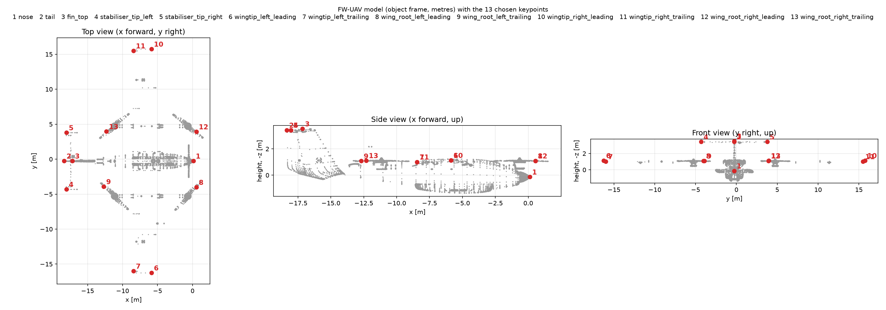
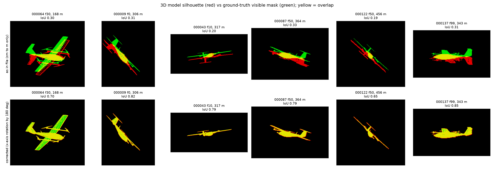

### Observations

- **Projection:** each keypoint is projected with the frame's ground-truth pose and intrinsics.
- **Visibility:** a keypoint is visible if it projects inside the image and **inside the visible mask dilated by 2 px**.
  The dilation is needed because many keypoints (wing tips, tail corners) lie *on* the silhouette boundary: with the
  strict mask only **57.2 %** of keypoints are visible
  (187 of 2400 frames have fewer than 6, 7 fewer than 4); with the
  dilation **99.4 %** (at least 10 of 13 in every frame; per-keypoint rates
  97.1-100.0 %). **This ignores self-occlusion inside the silhouette**
  (a keypoint behind the fuselage or wing still counts as visible), so it is optimistic.
- **Noise:** Gaussian pixel noise of 0, 1, 2 and 5 px, 5 seeds; every method sees identical noisy pixels.
- **Frame:** everything is in the **camera frame**: translation of the UAV in the camera frame (m) and the rotation
  `R_m2c`. Errors are the translation error (m) and the geodesic rotation error (deg). The Kalman state uses the
  project's pose vector `[x, y, z, roll, pitch, yaw]` with ZYX Euler angles of `R_m2c`.

### Methods

- **PnP only (SQPnP)** on the visible keypoints, no initial guess. A *failure* is no solution, a translation error
  above 10 % of the range, or a rotation error above 20 deg (a relative version of the Phase 4 definition,
  because the ranges are about five times larger).
- **Range-calibrated Kalman filter** (Phase 5b) on the PnP measurements of each sequence: unchanged dynamics,
  `A_MAX`, `W_MAX`, `V_INIT_MAX`, chi-squared gate and re-initialisation after 3 gated measurements (only the PnP
  measurement and the dt differ). **Scene `000125` is cut into two sequences** and the filter restarted, because the
  scene is a **cut between two sequences** (frames 0-76 and 77-99): between frames **76 and 77** the true translation jumps by
  217 m and the rotation by 131 deg, while every frame is consistent with its own mask (Phase 7b checked this), so the
  frames themselves are fine and the filter must not bridge the cut. Restarting it there is still correct. (The brief asked
  for the cut "at frame 76"; the jump is after frame 76, so the second sequence starts at frame 77.) PnP keeps all frames.
- **Measurement noise R** is calibrated by range bin on **synthetic poses made with this UAV model, its intrinsics and
  distance range** (4000 poses per noise level, range 140-540 m, direction through a random pixel, orientation uniform
  on SO(3) with |pitch| < 80 deg because Euler angles are ill-defined near 90 deg), never on the validation poses; bins
  140-250, 250-350, 350-450 and 450+ m, linear interpolation between bin centres, gross failures removed
  (`results/phase7a/uav_noise_calibration.json`). Calibrated std of the depth / lateral x / roll error [m / m / deg]:

| Noise | 150-250 m | 250-350 m | 350-450 m | 450+ m |
|---|---|---|---|---|
| 1 px | 0.7 / 0.2 / 0.5 | 1.5 / 0.3 / 0.7 | 2.5 / 0.6 / 1.0 | 3.7 / 0.8 / 1.2 |
| 2 px | 1.3 / 0.3 / 1.0 | 3.0 / 0.7 / 1.5 | 5.1 / 1.2 / 2.0 | 7.7 / 1.7 / 2.3 |
| 5 px | 3.5 / 0.8 / 2.5 | 8.1 / 1.9 / 3.4 | 14.8 / 3.4 / 4.7 | 22.0 / 5.0 / 5.7 |

- **Classifier-based methods (classifier + PnP, hybrid) were skipped.** They would need a classifier retrained for this
  UAV, camera and 100-500 m range, and, because the aircraft attitude here is arbitrary, a pose grid over the whole of
  SO(3) rather than the 4800-cell position-and-roll grid of Phase 2; that is a different design problem, not a
  retraining, and SQPnP is global and needs no initial guess.
- **dt sensitivity:** the filter was also run with dt = 0.05 s and 0.2 s at 2 px; dt = 0.1 s is the main result and
  was not chosen for its numbers.
- **`A_MAX` (2 m/s^2), `W_MAX` (20 deg/s) and `V_INIT_MAX` (5 m/s) were chosen in Phase 3/5 for a 40-90 m simulated
  approach, not for this aircraft at 164-518 m.** In the scenes we examined the relative speed is 5-9 m/s (median, up to 24 m/s) with
  accelerations up to 8 m/s^2 (the model allows about 2), so the model is mismatched; we did not change them.

### Results

All 2400 frames, mean over 5 seeds ± std over seeds of the pooled error, medians over frames.

| Noise | Method | Trans mean [m] | Trans median [m] | Rot mean [deg] | Rot median [deg] | PnP failure | Kalman gate rejection | Kalman re-inits / 2400 frames |
|---|---|---|---|---|---|---|---|---|
| 0 px | PnP only (SQPnP) | 0.00 ± 0.00 | 0.00 | 0.00 ± 0.00 | 0.00 | 0.00 % | - | - |
| | Range-calibrated Kalman | 1.86 ± 0.00 | 0.00 | 0.12 ± 0.00 | 0.00 | - | 13.1 % | 98 |
| 1 px | PnP only (SQPnP) | 1.25 ± 0.03 | 0.86 | 0.55 ± 0.05 | 0.44 | 0.04 % | - | - |
| | Range-calibrated Kalman | 3.03 ± 0.44 | 0.60 | 0.49 ± 0.06 | 0.33 | - | 12.5 % | 81 |
| 2 px | PnP only (SQPnP) | 2.59 ± 0.10 | 1.76 | 1.36 ± 0.05 | 0.88 | 0.29 % | - | - |
| | Range-calibrated Kalman | 3.09 ± 0.34 | 1.15 | 0.79 ± 0.06 | 0.59 | - | 10.2 % | 61 |
| 5 px | PnP only (SQPnP) | 7.15 ± 0.11 | 4.84 | 5.60 ± 0.19 | 2.24 | 2.43 % | - | - |
| | Range-calibrated Kalman | 5.10 ± 0.59 | 3.52 | 2.57 ± 0.50 | 1.29 | - | 8.1 % | 31 |

Mean translation error [m] (and as % of the range) / mean rotation error [deg] by true distance (frames in each bin at 2 px
shown in the first row; the bins hold different scenes, so this mixes distance with scene and attitude):

| Noise | Method | 150-250 m | 250-350 m | 350-450 m | 450+ m |
|---|---|---|---|---|---|
| | frames in bin | 846 | 884 | 527 | 143 |
| 1 px | PnP only | 0.63 m (0.29 %) / 0.35° | 1.17 m (0.39 %) / 0.50° | 1.97 m (0.51 %) / 0.64° | 2.66 m (0.55 %) / 1.74° |
| 1 px | Kalman | 3.69 m (1.59 %) / 0.39° | 3.75 m (1.17 %) / 0.48° | 1.22 m (0.31 %) / 0.46° | 1.38 m (0.28 %) / 1.25° |
| 2 px | PnP only | 1.27 m (0.57 %) / 0.72° | 2.39 m (0.80 %) / 1.04° | 4.19 m (1.08 %) / 1.83° | 5.75 m (1.19 %) / 5.32° |
| 2 px | Kalman | 4.17 m (1.81 %) / 0.62° | 2.45 m (0.79 %) / 0.75° | 2.54 m (0.65 %) / 1.03° | 2.73 m (0.57 %) / 1.27° |
| 5 px | PnP only | 3.44 m (1.56 %) / 3.00° | 6.66 m (2.22 %) / 4.46° | 11.42 m (2.93 %) / 8.72° | 16.39 m (3.39 %) / 16.46° |
| 5 px | Kalman | 3.56 m (1.59 %) / 1.62° | 4.03 m (1.36 %) / 1.68° | 7.47 m (1.91 %) / 3.56° | 12.11 m (2.51 %) / 10.13° |

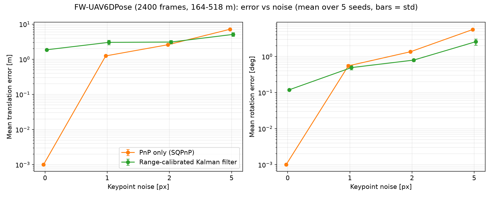
(PnP at 0 px is exact to about 1e-6 and is drawn at the 1e-3 floor.)

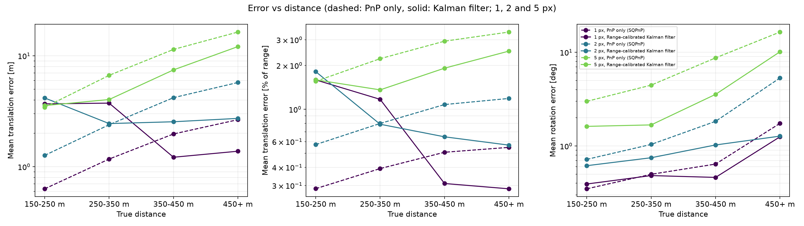

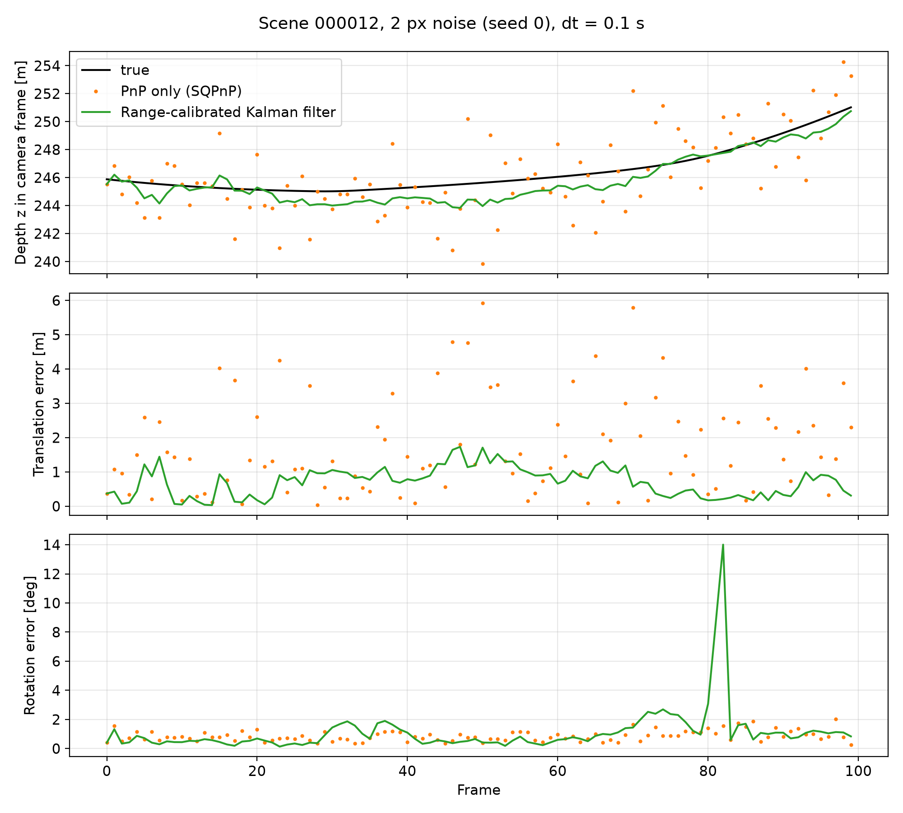

**dt sensitivity (Kalman filter, 2 px):**

| dt | Trans mean [m] | Rot mean [deg] | Gate rejection | Re-inits |
|---|---|---|---|---|
| 0.1 s (main) | 3.09 ± 0.34 | 0.79 ± 0.06 | 10.2 % | 61 |
| 0.05 s | 5.51 ± 0.78 | 0.92 ± 0.06 | 18.5 % | 120 |
| 0.2 s | 1.27 ± 0.07 | 0.80 ± 0.07 | 3.5 % | 11 |

**Per scene at 2 px** (mean over seeds; the Kalman filter beats PnP in translation in 20 of 24 scenes):

| Scene | Range [m] | PnP trans / rot | Kalman trans / rot | Gate rejection | Re-inits |
|---|---|---|---|---|---|
| 000009 | 306-332 | 2.77 m / 0.98° | 12.02 m / 0.92° | 42 % | 12.6 |
| 000010 | 185-265 | 1.45 m / 1.13° | 0.70 m / 0.72° | 22 % | 4.6 |
| 000011 | 295-351 | 2.73 m / 1.56° | 1.41 m / 0.70° | 10 % | 2.2 |
| 000012 | 254-260 | 1.87 m / 0.85° | 0.96 m / 1.16° | 3 % | 1.0 |
| 000029 | 280-350 | 2.73 m / 1.01° | 1.33 m / 0.62° | 0 % | 0.0 |
| 000030 | 175-234 | 1.27 m / 0.68° | 0.50 m / 0.43° | 0 % | 0.0 |
| 000042 | 241-254 | 1.74 m / 0.76° | 1.08 m / 1.05° | 3 % | 1.0 |
| 000043 | 310-381 | 2.70 m / 1.07° | 1.13 m / 0.59° | 0 % | 0.0 |
| 000044 | 241-290 | 2.01 m / 0.80° | 1.09 m / 0.47° | 0 % | 0.0 |
| 000045 | 244-247 | 1.68 m / 0.69° | 0.62 m / 0.52° | 0 % | 0.0 |
| 000064 | 165-205 | 0.81 m / 0.63° | 0.98 m / 0.39° | 0 % | 0.0 |
| 000065 | 164-211 | 0.78 m / 0.61° | 0.90 m / 0.37° | 0 % | 0.0 |
| 000066 | 211-278 | 1.36 m / 0.81° | 0.65 m / 0.62° | 9 % | 1.8 |
| 000086 | 265-289 | 1.95 m / 1.27° | 1.55 m / 0.95° | 0 % | 0.0 |
| 000087 | 337-384 | 4.07 m / 1.86° | 1.62 m / 0.76° | 1 % | 0.0 |
| 000088 | 271-288 | 2.43 m / 1.04° | 1.25 m / 0.75° | 0 % | 0.0 |
| 000096 | 197-247 | 1.07 m / 0.69° | 29.59 m / 0.99° | 82 % | 26.8 |
| 000111 | 225-230 | 1.36 m / 0.68° | 0.60 m / 0.46° | 0 % | 0.0 |
| 000122 | 413-505 | 5.22 m / 3.80° | 2.25 m / 1.25° | 20 % | 2.6 |
| 000123 | 379-412 | 4.64 m / 1.57° | 3.40 m / 0.92° | 1 % | 0.0 |
| 000124 | 380-437 | 4.14 m / 1.42° | 3.79 m / 0.77° | 1 % | 0.0 |
| 000125 | 438-518 | 5.62 m / 4.64° | 3.01 m / 1.21° | 24 % | 3.0 |
| 000136 | 344-443 | 4.02 m / 2.97° | 2.08 m / 1.87° | 27 % | 5.0 |
| 000137 | 343-357 | 3.72 m / 1.02° | 1.76 m / 0.56° | 0 % | 0.0 |

### What changes at 164-518 m with a 32 m UAV

- **Absolute translation error is larger and grows with range, relative error is small.** At 2 px, PnP alone gives
  2.59 m / 1.36 deg (synthetic approach at 40-90 m: 0.89 m / 1.50 deg), which is
  0.57 % of the range at 150-250 m and 1.19 % at 450+ m. At 5 px it is
  7.15 m / 5.60 deg (synthetic: 2.76 m / 4.35 deg). The error is dominated by depth
  (the calibrated depth std is 4-7 times the lateral std) and grows roughly as range squared. Rotation error is
  of the same order as in the simulation (we did not investigate why it does not grow with range as the translation does).
- **The Kalman filter helps rotation and the typical frame, but not the mean translation at low noise.** At 2 px its
  median errors are better than PnP's (1.15 vs 1.76 m, 0.59 vs 0.88 deg) and
  its mean rotation error is lower (0.79 vs 1.36 deg), and at 5 px it is better in
  both means (5.10 vs 7.15 m, 2.57 vs 5.60 deg). But at 0-2 px its
  **mean translation error is higher than PnP's** (1.86 vs 0.00 m at 0 px, 3.03 vs 1.25 at 1 px,
  3.09 vs 2.59 at 2 px).
- **Why: gate lock-outs.** The gate rejects 10 % of the measurements at 2 px (nominal 0.1 %; 8-13 % at all
  noise levels; the Phase 5b simulation had 0.4 %). Mostly it is two scenes, `000096` and `000009`, in which the
  position estimate drifts away from the true motion (faster relative accelerations than the model allows) and every
  measurement is then gated: the re-initialisation resets only the attitude (as in Phase 5b), not the position, so the
  position error stays at tens of metres (30 m mean in `000096` at 2 px). At 0 px the
  floor on R (0.01 m) makes the gate hypersensitive to any model mismatch, so even the noise-free filter loses
  13 % of its measurements. In scene `000136` (pitch up to 89 deg, a 40 deg jump in the
  Euler angles between two frames) the gate rejects 27 % of the measurements and its rotation error is the largest of all
  scenes; we did not verify that this is the cause for every gated scene.
  We did not tune anything to fix this.
- **dt matters.** A smaller assumed dt makes the filter worse (translation 5.51 m at dt = 0.05 s,
  3.09 m at 0.1 s, 1.27 m at 0.2 s) and gates more measurements (19 %, 10 %, 4 %); we did not
  investigate why. The 0.1 s result is the main one; the others only show that the outcome depends on this assumption.

### Limitations and next step

- Keypoints are ideal (the true projections) plus Gaussian noise; there is no detector, no outliers and no mislabelled
  keypoints. Visibility ignores self-occlusion; the dilated mask test is generous.
- Validation split only (24 scenes, one camera, 100 frames each, so 2400 correlated frames); the noise calibration is on
  synthetic poses with uniformly random attitude, which the real flights do not follow.
- The OBJ has missing wing faces and is slightly asymmetric; keypoints were checked against the mesh, not an
  independent CAD model.
- dt is assumed. Filter constants are those of the simulation. Euler angles are used for the attitude state, which
  breaks down near pitch +/-90 deg.
- **Next step (7b):** a YOLO keypoint detector trained on the dataset's images, replacing the projected keypoints.


## Phase 7a-fix: full-state re-initialisation of the Kalman filter

**Why.** On FW-UAV6DPose the Phase 5b filter locked out in some scenes (`000096`: 82 % of the measurements gated, 30 m mean
translation error at 2 px): the position estimate drifts away from the true motion, every measurement is then rejected, and
the Phase 5b re-initialisation resets only the attitude, so the position never recovers. The fix was decided in advance and
is not tuned: after 3 consecutive gated measurements the **whole state is reset from the current PnP measurement**
(position and attitude = measurement with covariance R, velocities and rates 0 with the initial std of the first step).
`RangeKalmanFilter(..., reinit_mode="full")` is now the default; `reinit_mode="attitude"` is the Phase 5b behaviour and the
Phase 5b / Phase 6 scripts and tests request it explicitly (their stored results still reproduce exactly).
`A_MAX`, `W_MAX`, `V_INIT_MAX` and dt are unchanged: retuning them on the validation set would be tuning on test data.

```bash
.venv/bin/python phase7a_evaluate.py --reinit attitude   # before -> results/phase7a/
.venv/bin/python phase7a_evaluate.py                     # after  -> results/phase7a_fix/
.venv/bin/python phase7a_fix_report.py                   # before/after tables and figure
.venv/bin/python run_phase7a_fix_synthetic.py            # synthetic Phase 5/5b check
```

### FW-UAV6DPose: before / after (all 2400 frames, mean ± std over 5 seeds)

| Noise | Filter | Trans mean [m] | Trans median [m] | Rot mean [deg] | Rot median [deg] | Gate rejection | Re-inits |
|---|---|---|---|---|---|---|---|
| 0 px | PnP only (reference) | 0.00 | 0.00 | 0.00 | 0.00 | - | - |
| | Kalman, attitude re-init (before) | 1.86 ± 0.00 | 0.00 | 0.12 ± 0.00 | 0.00 | 13.1 % | 98 |
| | Kalman, full re-init (after) | 0.01 ± 0.00 | 0.00 | 0.07 ± 0.00 | 0.00 | 5.5 % | 39 |
| 1 px | PnP only (reference) | 1.25 | 0.86 | 0.55 | 0.44 | - | - |
| | Kalman, attitude re-init (before) | 3.03 ± 0.44 | 0.60 | 0.49 ± 0.06 | 0.33 | 12.5 % | 81 |
| | Kalman, full re-init (after) | 0.78 ± 0.03 | 0.55 | 0.45 ± 0.06 | 0.32 | 6.2 % | 32 |
| 2 px | PnP only (reference) | 2.59 | 1.76 | 1.36 | 0.88 | - | - |
| | Kalman, attitude re-init (before) | 3.09 ± 0.34 | 1.15 | 0.79 ± 0.06 | 0.59 | 10.2 % | 61 |
| | Kalman, full re-init (after) | 1.52 ± 0.07 | 1.06 | 0.76 ± 0.06 | 0.57 | 5.4 % | 23 |
| 5 px | PnP only (reference) | 7.15 | 4.84 | 5.60 | 2.24 | - | - |
| | Kalman, attitude re-init (before) | 5.10 ± 0.59 | 3.52 | 2.57 ± 0.50 | 1.29 | 8.1 % | 31 |
| | Kalman, full re-init (after) | 4.73 ± 0.10 | 3.50 | 2.53 ± 0.46 | 1.28 | 6.8 % | 21 |

| Scene (2 px) | PnP trans / rot | Kalman before: trans / rot, gate, re-inits | Kalman after: trans / rot, gate, re-inits |
|---|---|---|---|
| 000096 | 1.07 m / 0.69° | 29.59 m / 0.99°, 82 %, 26.8 | 0.57 m / 0.51°, 3 %, 1.0 |
| 000009 | 2.77 m / 0.98° | 12.02 m / 0.92°, 42 %, 12.6 | 1.53 m / 0.64°, 5 %, 0.6 |

Kalman beats PnP in translation in 20 of 24 scenes before and 22 after (2 px).

| dt | Trans mean before / after [m] | Rot mean before / after [deg] | Gate rejection before / after | Re-inits before / after |
|---|---|---|---|---|
| 0.1 s | 3.09 / 1.52 | 0.79 / 0.76 | 10.2 % / 5.4 % | 61 / 23 |
| 0.05 s | 5.51 / 1.84 | 0.92 / 0.89 | 18.5 % / 8.5 % | 120 / 43 |
| 0.2 s | 1.27 / 1.31 | 0.80 / 0.80 | 3.5 % / 3.5 % | 11 / 10 |

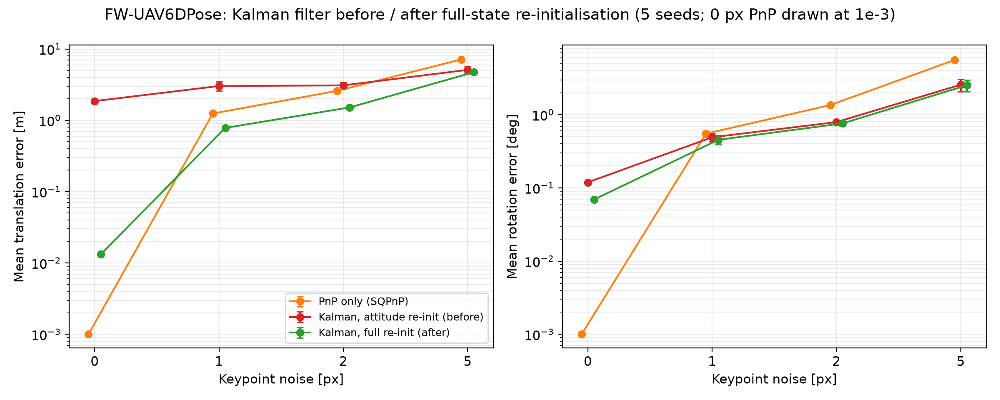

- **The lock-outs are gone.** At 2 px the mean translation error falls from 3.09 to **1.52 m** (PnP alone: 2.59 m), the
  mean rotation error from 0.79 to 0.76 deg, and the filter now beats PnP in translation at 1, 2 and 5 px and in
  22 of 24 scenes (at 0 px PnP is exact and the filter is 0.01 m off). Scenes `000096` and `000009` drop from 29.6 / 12.0 m to 0.57 / 1.53 m.
- **At 0 px** the filter is now close to exact (0.01 m) instead of losing 1.9 m on average.
- **Median errors barely change** (1.15 to 1.06 m at 2 px): the fix removes the catastrophic tail, not the typical error.
- **The gate still rejects 5-7 % of the measurements** (nominal 0.1 %; 0.4 % on the synthetic approach) and there are
  still 21-39 re-initialisations over the 2400 frames: the motion model does not fit the aircraft's manoeuvres (below).
- **dt sensitivity is much smaller after the fix:** 1.84 / 1.52 / 1.31 m translation at dt = 0.05 / 0.1 / 0.2 s, against
  5.51 / 3.09 / 1.27 m before. 0.1 s remains the main result (it was fixed in advance, not picked for its numbers).

### Synthetic check (Phase 5 / 5b experiments, same seeds and settings)

Experiment A is **unchanged** at every noise level: no re-initialisation ever triggers in the normal run. In experiment B
(outage 4-5 s) the full reset is **slightly worse in position after the outage** (it throws away a good position and velocity
estimate when it resets) and the same in attitude:

| Noise | Filter | Pos mean / att mean, normal run | Gate rejection | Pos in outage / after [m] | Att in outage / after [deg] | Re-inits (outage run) |
|---|---|---|---|---|---|---|
| 0 px | attitude re-init (Phase 5b) | 0.00 m / 0.00° | 0.0 % | 0.00 / 0.00 | 4.10 / 0.00 | 0.0 |
| 0 px | full re-init | 0.00 m / 0.00° | 0.0 % | 0.00 / 0.00 | 4.10 / 0.00 | 0.0 |
| 1 px | attitude re-init (Phase 5b) | 0.23 m / 0.76° | 0.4 % | 0.44 / 0.36 | 9.13 / 4.78 | 1.0 |
| 1 px | full re-init | 0.23 m / 0.76° | 0.4 % | 0.44 / 0.42 | 9.13 / 4.78 | 1.0 |
| 2 px | attitude re-init (Phase 5b) | 0.43 m / 1.53° | 0.4 % | 0.73 / 0.61 | 12.13 / 6.21 | 1.0 |
| 2 px | full re-init | 0.43 m / 1.53° | 0.4 % | 0.73 / 0.80 | 12.13 / 6.22 | 1.0 |
| 5 px | attitude re-init (Phase 5b) | 1.03 m / 3.66° | 0.8 % | 1.63 / 1.33 | 16.44 / 8.89 | 1.0 |
| 5 px | full re-init | 1.03 m / 3.66° | 0.8 % | 1.63 / 1.76 | 16.44 / 8.92 | 1.0 |

At 2 px the position error in the second after the outage is 0.80 m instead of 0.61 m (1.76 instead of 1.33 m at 5 px,
0.42 instead of 0.36 m at 1 px); everything else, including the 4.8-8.9 deg attitude error after the outage, is the same to
within 0.03 deg. Full numbers: `results/phase7a_fix/synthetic_comparison.json`.

### Limitations that remain

- **Motion-model mismatch.** The filter's dynamics (`A_MAX` = 2 m/s^2 for position, `W_MAX` = 20 deg/s for attitude rates,
  `V_INIT_MAX` = 5 m/s) were chosen for a 40-90 m simulated approach. In the FW-UAV6DPose scenes we examined, accelerations reach
  about **8 m/s^2** and the relative speed up to 24 m/s. This is why the gate still rejects 5-7 % of the measurements and the
  filter re-initialises often. We **did not retune** the constants, to avoid tuning on the test data; a principled
  alternative would be to fit them on scenes that are not used for the evaluation (Phase 7a uses the validation split only).
- **Sensitivity to the assumed dt.** The dataset has no timestamps; dt = 0.1 s is an assumption. Before the fix the result
  depended strongly on it (3.09 m at 0.1 s, 5.51 m at 0.05 s, 1.27 m at 0.2 s); after the fix the spread is small
  (1.52, 1.84, 1.31 m) but not zero, and the true dt is unknown.
- **Euler-angle singularities.** The attitude state uses ZYX Euler angles, which are discontinuous near +/-90 deg pitch. Several
  scenes pass near it (`000011`: pitch to -89 deg, `000136`: to +89 deg with a 40 deg jump in the Euler angles between two
  frames, `000125`) and `000136` still has 27 % of its measurements gated and the largest rotation error of the scenes. A
  **quaternion-based filter** (a multiplicative extended Kalman filter on the rotation) is the natural fix and future work.
- The re-initialisation threshold (3) was fixed in Phase 5b and is unchanged.

## Phase 7b: YOLO-pose keypoint detector and image-based evaluation

Phase 7a used the true keypoint projections plus Gaussian noise. Phase 7b replaces them with a **learned detector** on the
real images. **Part A** prepares the data and the training notebook (training ran on Google Colab); **part B** (the last
subsection, "Phase 7b: image-based evaluation") evaluates the detector and the full image -> pose pipeline on the test scenes.
**Result in one line: the pipeline is not usable with this detector** (70 % of test frames fail); the limits are the detector's
generalisation to new orientations and the precision of its keypoints, not the pose estimation itself.

| File | Purpose |
|------|---------|
| `fw_uav_split.json` | The scene split (train / val / test) and the reasoning behind it |
| `phase7b_prepare.py` | Builds the YOLO-pose dataset, the zip and the label-check figures |
| `notebooks/train_yolo_pose_colab.ipynb` | Colab notebook: Drive, GPU check, training with resume, validation metrics |
| `models/fw_uav_yolo_pose.pt` | The trained detector (YOLO11n-pose, 6 MB) |
| `phase7b_detect.py` | Part B: runs the detector on the val or test scenes and caches the raw predictions in `data/fw_uav/` |
| `phase7b_eval.py` | Part B: library (ground truth, keypoint diagnostics, OKS, PnP / RANSAC / symmetry-aware PnP, Kalman wrapper) |
| `phase7b_tune_val.py` | Part B: every threshold and method choice, made on the val scenes only -> `results/phase7b/val_choices.json` |
| `phase7b_evaluate.py` | Part B: reads `val_choices.json`, evaluates the test scenes once, writes the results JSON and figures |
| `test_phase7b.py` | Sanity checks (prints PASS/FAIL) |
| `results/phase7b/label_check_*.png`, `dataset_summary.json` | Label drawings and the dataset summary |
| `results/phase7b/val_*.json`, `test_*.json`, `test_*.png` | Part B results and figures |

```bash
.venv/bin/python phase7b_prepare.py     # about 1 min: data/fw_uav/yolo_fw_uav/ and yolo_fw_uav.zip (data/ is not in git)
.venv/bin/python test_phase7b.py
# then upload data/fw_uav/yolo_fw_uav.zip to Google Drive: MyDrive/formation-pose/ and run the notebook
```

### Scene split (by scene, never by frame)

16 train / 4 val / 4 test scenes of the 24 validation scenes (2400 frames, 100 per scene).

| Split | Scenes | Range |
|---|---|---|
| train (1600 frames) | 000009-000012, 000064-000066, 000086-000088, 000096, 000111, 000122-000125 | 164-518 m |
| val (400 frames, early stopping) | 000042-000045 | 241-381 m |
| test (400 frames, never used for training or tuning) | 000029, 000030, 000136, 000137 | 175-443 m |

- The test scenes cover near (`000030`, 175-234 m), middle (`000029`, 280-350 m) and far (`000136`, `000137`, 343-443 m)
  distances. Scene `000125` is not in the test split.
- Scenes with consecutive ids share the same sky background (checked by eye on the first frame of every scene). The split
  keeps each such **background group** inside one split, so no background or neighbouring flight is shared between train, val
  and test. The groups were **assigned by visual inspection** of the images, not from dataset metadata.
- The test scenes span **175-443 m**, so the detector is **not tested beyond 450 m**: the only frames beyond 450 m belong to `000122` and `000125`, which are in training, so the
  detector is not tested at the largest ranges.
- Scene `000125` has the sequence cut between frames 76 and 77 (a 217 m jump in the true translation). Every frame is
  consistent with its own mask (silhouette IoU 0.72-0.77 on both sides of the cut), so its labels are valid and it is used
  for training; the cut matters only for temporal filtering.

### Labels (YOLO-pose format)

- One object per frame, class 0 (`uav`). The **box** is the bounding box of the visible-object mask plus 4 px on every side,
  normalised.
- The **13 keypoints** of `fw_uav_config.py` are projected with the ground-truth pose, the corrected model (cm to m, 180 degrees
  about x) and the frame's intrinsics. `v = 2` if the keypoint is inside the image and inside the mask dilated by 2 px (the same
  visibility as Phase 7a, which ignores self-occlusion), otherwise `v = 0` with x = y = 0. On average 12.97 of 13 keypoints are
  visible in the training labels.
- `kpt_shape: [13, 3]` and `flip_idx: [0, 1, 2, 4, 3, 9, 10, 11, 12, 5, 6, 7, 8]` (the stabiliser tips swap, each wingtip and
  wing-root corner swaps with its partner on the other side; nose, tail and fin top map to themselves). It was checked three
  ways: it is derived from the keypoint names, it is an involution, and mirroring the keypoints about the aircraft's
  centreline maps each one closest to its partner (`prep.check_flip_idx`). **Caveat:** the mirror images are exact (< 0.02 m) for
  the wingtips and the tail, but the wing-root keypoints were picked at |y| = 4.2 m rather than as mirror images, so they are
  0.43 m (leading edge) and 0.69 m (trailing edge) off; on a flipped training sample those two keypoints are
  inconsistent by up to about 5 px at 300 m. We left the keypoints unchanged (they are the Phase 7a keypoints) and **trained without horizontal flip** instead.
- `results/phase7b/label_check_1.png` to `label_check_3.png` draw the box and keypoints on 12 training and validation frames
  (blue = left, red = right, green = centreline); `label_check_flip.png` shows that a flipped image with labels flipped
  through `flip_idx` keeps every index on the same part.

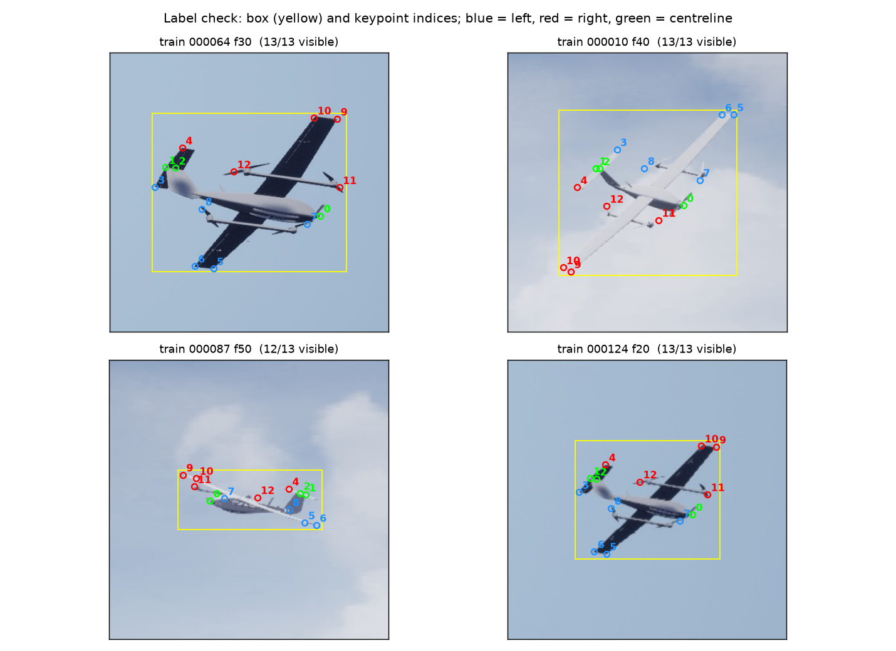

### Package

Train and val images are converted to JPEG (quality 95) and written with the labels to `yolo_fw_uav/{images,labels}/{train,val}`
plus `data.yaml` (relative paths), zipped to `data/fw_uav/yolo_fw_uav.zip` (267 MB, 2000 images, **no test-scene image**).
An Ultralytics 8.4.171 smoke test on CPU (one epoch at 320 px on 32 images) read the dataset without errors (0 corrupt labels,
`kpt_shape` and `flip_idx` accepted), which checks the format, not the quality of any training.

### Training plan (Colab, `notebooks/train_yolo_pose_colab.ipynb`)

`yolo11n-pose.pt` (the smallest YOLO pose model), `imgsz=1280` (the aircraft is small in the 1920 x 1080 frames), 100 epochs,
patience 20 on the validation split, batch 8 on a free T4, **horizontal flip off** (`fliplr=0`, because the wing-root keypoints are not exact mirror images, so
flipped labels would carry up to about 5 px of error; `flip_idx` stays in `data.yaml`), other augmentations at the Ultralytics defaults. Checkpoints (`last.pt` every epoch, `best.pt`, a copy every 5 epochs) are saved to Google Drive and
the training cell resumes from `last.pt` after a disconnect. The notebook ends by printing the validation box and pose mAP.
The notebook itself has not been run on a GPU yet.

### Phase 7b: image-based evaluation

**Training.** YOLO11n-pose, `imgsz=1280`, no horizontal flip, on the 16 training scenes (1,600 images), early stopping on the 4 val
scenes: 69 epochs (the patience of 20 stopped it; the best epoch was 49), 2.1 h on a Colab T4. On the val scenes the best model
reaches **box mAP50 0.973 / mAP50-95 0.819** but **pose mAP50 only 0.141 / mAP50-95 0.111**. Validation pose mAP barely improved
during training while the training pose loss kept falling, i.e. the model fits the training scenes but does not generalise to
the val scenes. Re-evaluating the saved weights on the Mac (MPS) reproduces the numbers (0.973 / 0.822 / 0.141 / 0.112).

**Protocol.** The detector (`imgsz=1280`, each frame JPEG-encoded at quality 95 like the training images) ran on the val and the
test scenes (400 frames each). Every threshold and method choice was made on the **val scenes only** (`phase7b_tune_val.py`,
saved in `results/phase7b/val_choices.json`); the test scenes were then run once (`phase7b_evaluate.py`) with no pipeline
change. Choices (rule: lowest failure rate, ties within 0.5 points by mean translation error): box confidence 0.1, keypoint
confidence 0.98, RANSAC reprojection threshold 32 px, best single-frame method symmetry-aware RANSAC, Kalman R calibrated at
10 px (Phase 7a-fix filter, full re-initialisation). **These choices are close to arbitrary**: on val all four single-frame
methods fail on the same 87.25 % of frames, so the selection could not tell them apart. A frame "fails" (as in Phase 7a) if there
is no solution, the position error exceeds 10 % of the range or the rotation error exceeds 20 degrees. Ground truth is the model
keypoints projected with the true pose (visible = inside the mask dilated by 2 px).

```bash
.venv/bin/python phase7b_detect.py --split val && .venv/bin/python phase7b_tune_val.py
.venv/bin/python phase7b_detect.py --split test && .venv/bin/python phase7b_evaluate.py
```

#### Keypoint diagnostics

| | Val (000042-000045) | Test (000029, 000030, 000136, 000137) |
|---|---|---|
| Detection rate (box conf >= 0.1) | 100 % | 100 % |
| Median box IoU | 0.92 | 0.93 |
| Keypoint error, median / 90th percentile | 53 / 123 px | 16 / 132 px |
| by distance 150-250 / 250-350 / 350-450 m (median) | 45 / 56 / 77 px | 9 / 65 / 12 px |
| Left/right swap rate | 37.6 % | 43.4 % |
| Leading/trailing swap rate | 45.9 % | 32.8 % |
| Frames with a majority of left/right swaps | 33.5 % | 56.2 % |
| Mean OKS (Ultralytics definition) | 0.26 | 0.49 |
| Frames with OKS > 0.5 | 19 % | 44 % |
| ... with an oracle that undoes the best whole-aircraft mirror | 19 % | 50 % |
| ... with an oracle that fixes every left/right pair | 19 % | 50 % |
| ... with an oracle that fixes every leading/trailing pair | 19 % | 44 % |

The box is very good (the median label box is 186 x 78 px on val). The keypoints are not: the error is **bimodal by scene**.

| Scene | Range [m] | Keypoint error median / p90 [px] | Frames OKS > 0.5 | L/R swap rate | Nearest-training-pose distance, median (max) |
|---|---|---|---|---|---|
| val 000042 | 241-254 | 8 / 82 | 77 % | 10 % | 15 (23) deg |
| val 000043 | 310-381 | 54 / 117 | 0 % | 45 % | 35 (41) deg |
| val 000044 | 241-290 | 80 / 161 | 0 % | 72 % | 20 (28) deg |
| val 000045 | 244-247 | 64 / 114 | 0 % | 25 % | 19 (22) deg |
| test 000029 | 280-350 | 84 / 159 | 0 % | 70 % | 17 (23) deg |
| test 000030 | 175-234 | 9 / 20 | 100 % | 8 % | 18 (22) deg |
| test 000136 | 344-443 | 10 / 50 | 75 % | 25 % | 6 (17) deg |
| test 000137 | 343-357 | 21 / 78 | 0 % | 90 % | 19 (23) deg |

(The nearest-training-pose distance is the geodesic angle between a frame's true object rotation in the camera frame and the
closest rotation among the 1,600 training frames. Per-keypoint, per-distance and per-confidence numbers are in
`val_results.json` and `test_results.json`.)

**Keypoint confidence is almost useless**: every confidence is above 0.94 (median 0.99). Only the top bin (>= 0.995) is clearly
better on val (median 16 px against 56-80 px below it) and it holds 19 % of the keypoints; on test the trend is reversed
(32 px for >= 0.995, 13-14 px for 0.97-0.99). A confidence threshold therefore cannot separate good keypoints from bad ones.

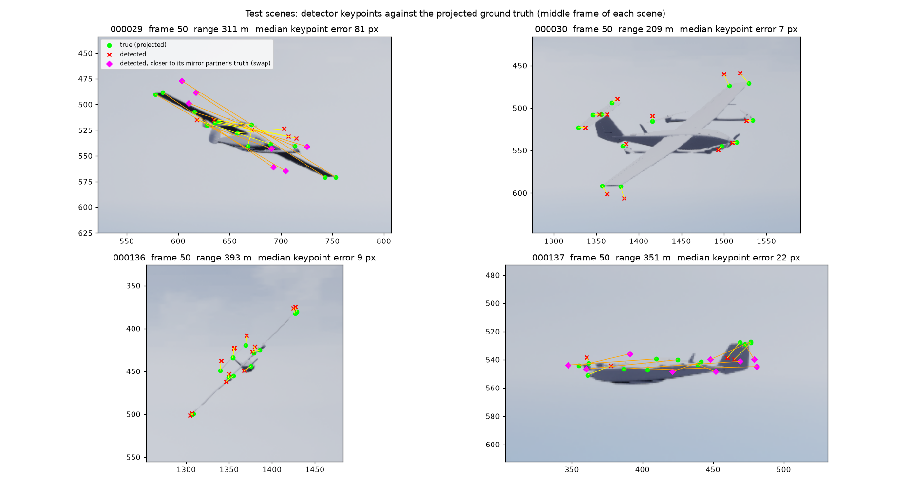

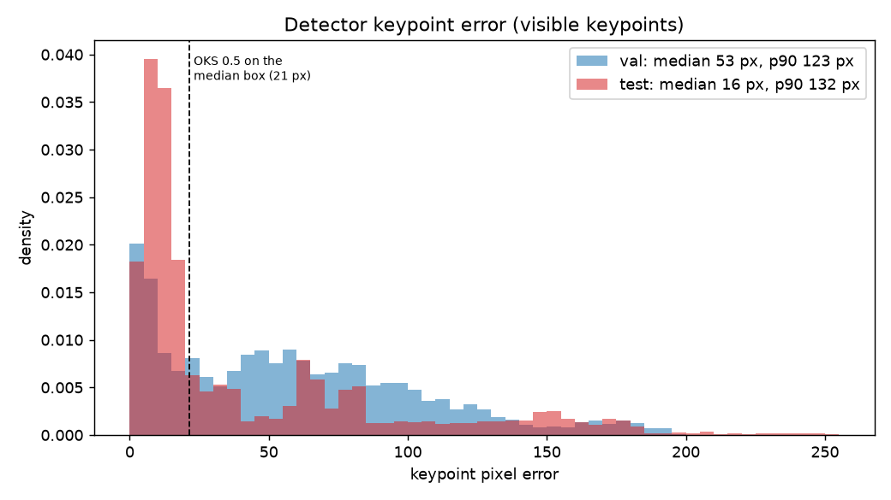

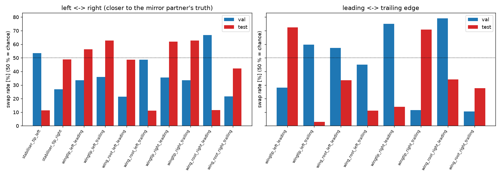

#### Why is the pose mAP low?

1. **Not swaps or leading/trailing confusion.** Raw swap rates look high (37-43 %), but they are inflated: when the keypoints are
   scattered 50-80 px from the truth, a point is often closer to the partner's true location by chance (50 % is chance level).
   The decisive test is the oracle: undoing every left/right swap leaves the fraction of val frames with OKS > 0.5 at 19 %
   (mean OKS 0.26 -> 0.31) and raises it from 44 % to 50 % on test; fixing leading/trailing confusion changes nothing
   (19 % -> 19 %, 44 % -> 44 %). Swaps explain at most a few points of the gap. Test scene 000029 has a 70 % swap rate, but
   mirroring its keypoints still leaves 1 % of its frames above OKS 0.5: its keypoints are wrong, not just mislabelled.
   The symmetry-aware PnP also does not help (below).
2. **Not mainly the OKS metric.** OKS is strict for this object (with Ultralytics' default sigma of 1/13, OKS 0.5 needs about
   21-24 px of error on the median box and OKS 0.75 about 14-15 px), but the good scenes pass it easily: test scene 000030
   (median error 9 px) has OKS > 0.5 on 100 % of its frames and 000136 on 75 %. The scenes that fail are 50-85 px off, a
   factor 2-4 beyond any reasonable tolerance.
3. **General imprecision that depends on the scene, i.e. poor generalisation.** The detector's keypoints in the failing scenes
   are not a few pixels off: in val scene 000043 the true wingtips are 190 px apart and the predicted ones about 120 px (they are
   pulled towards the fuselage, as if regressing towards an average pose). Training pose loss fell while validation pose mAP stayed flat,
   which points the same way. The training set is only 16 trajectories (1,600 strongly correlated frames), so the orientations
   and positions of an unseen scene are mostly new to the model.

**How strong is the evidence for "unseen orientations"?** It is consistent but not proven. The nearest-training-pose distance
agrees with the outcome at the extremes (test 000136 at 6 degrees works, val 000043 at 35 degrees is the worst keypoint scene, val 000042 at 15 degrees works), but within
15-20 degrees it does not separate the scenes: test 000030 (18 degrees) works while test 000029 (17 degrees) and val
000044 / 000045 (19-20 degrees) fail. The distance measures orientation only, not image position, scale, background or how
the aircraft is seen against it, so other differences between scenes matter too. Pinning this down needs an experiment
(for example training with held-out orientation ranges), which was outside this phase.

#### Pose methods on the detected keypoints (test scenes, 400 frames)

| Method | Failure % | Translation mean / median [m] | Rotation mean / median [deg] | No solution % |
|---|---|---|---|---|
| (a) SQPnP, keypoints with conf >= 0.98 | 70.0 | 38.8 / 18.0 | 63.4 / 45.1 | 0.5 |
| (b) RANSAC PnP (32 px) | 71.2 | 38.9 / 18.0 | 64.9 / 45.3 | 0.5 |
| (c) symmetry-aware SQPnP | 70.8 | 38.7 / 18.0 | 64.5 / 45.2 | 0.5 |
| (c) symmetry-aware RANSAC (chosen on val as best) | 71.2 | 38.9 / 18.0 | 64.9 / 45.3 | 0.5 |
| (d) Kalman filter on (c) symmetry-aware RANSAC | 71.0 | 36.0 / 15.5 | 65.8 / 45.2 | 0.0 |

The Kalman filter gated 10.9 % of the measurements it was offered and re-initialised 7 times. On val the same table reads 87.2 /
87.2 / 87.2 / 87.2 / 89.0 % failures with 102-108 m median translation error, so no method is separable from another on either set.

By distance (test; frames per bin 100 / 153 / 147; the 450+ m bin is empty because the test scenes end at 443 m):

| Bin | (a) SQPnP: fail %, translation median [m], rotation median [deg] | (d) Kalman: fail %, translation median, rotation median |
|---|---|---|
| 150-250 m | 50 %, 21.8 m, 8 deg | 55 %, 21.0 m, 8 deg |
| 250-350 m | 100 %, 22.7 m, 142 deg | 100 %, 11.5 m, 147 deg |
| 350-450 m | 52 %, 11.2 m, 15 deg | 52 %, 12.9 m, 46 deg |

The distance trend is confounded by the scenes (the 250-350 m bin contains the failing scene 000029 and most of 000137); it is not
a range effect. Per scene (SQPnP / Kalman failure %, SQPnP translation median, rotation median): 000029 100 / 100 %, 30.9 m, 151 deg;
000030 50 / 55 %, 21.8 m, 8 deg; 000136 30 / 29 %, 20.2 m, 12 deg; 000137 100 / 100 %, 10.6 m, 46 deg
(its translation is small but the rotation is wrong, so every frame fails).

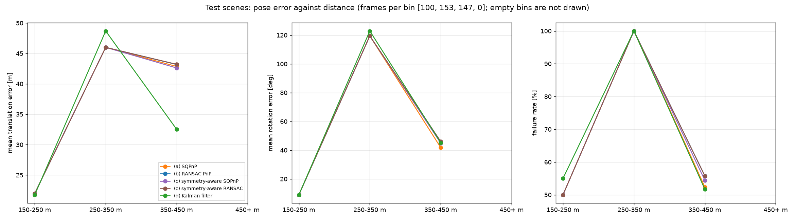

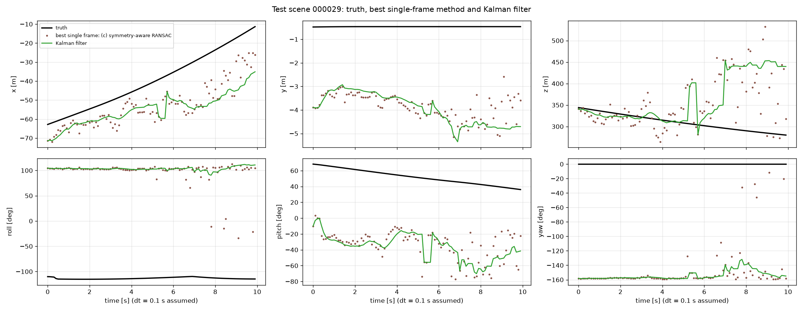

(Sequence figure: test scene 000029, chosen in advance as the middle-range scene. The estimate is stable but biased: the
roll/pitch/yaw solution is a consistent wrong orientation, and the Kalman filter smooths the noise without correcting the bias.)

#### Comparison with Phase 7a (same test scenes, ideal keypoints plus Gaussian noise, 5 seeds)

| Keypoints | PnP fail % | PnP translation mean / median [m] | PnP rotation mean / median [deg] | Kalman fail % | Kalman translation mean / median [m] | Kalman rotation mean / median [deg] |
|---|---|---|---|---|---|---|
| projected, 0 px | 0.0 | 0.00 / 0.00 | 0.0 / 0.0 | 0.0 | 0.31 / 0.21 | 0.1 / 0.0 |
| + 1 px | 0.0 | 1.43 / 1.07 | 0.5 / 0.5 | 0.0 | 0.82 / 0.55 | 0.4 / 0.3 |
| + 2 px | 0.3 | 2.94 / 2.21 | 1.4 / 0.9 | 0.1 | 1.47 / 1.04 | 0.9 / 0.5 |
| + 5 px | 4.0 | 8.01 / 6.09 | 8.1 / 2.4 | 1.6 | 4.40 / 3.71 | 3.8 / 1.2 |
| + 10 px (extra) | 27.0 | 19.74 / 16.01 | 23.6 / 5.0 | 8.3 | 16.96 / 15.93 | 10.4 / 2.4 |
| **YOLO-pose detector** | **70.0** | **38.8 / 18.0** | **63.4 / 45.1** | **71.0** | **36.0 / 15.5** | **65.8 / 45.2** |

**Effective noise.** Matching the detector's PnP result to PnP on projected keypoints with Gaussian noise (on the same test
scenes): the **median translation error corresponds to about 10.5 px**, the **failure rate to about 17 px**, but the **median
rotation error (45 degrees) corresponds to more than 60 px** (the largest noise level tried), and the median keypoint error (16 px)
corresponds to sigma = 14 px. So there is no single effective noise: the translation looks like 10-17 px of noise, the rotation
like far more. The reason is that the detector's errors are not independent noise: they are structured (a whole wing pulled in, a consistent
wrong orientation), which a Gaussian model with the same pixel size under-represents. On val the detector corresponds to
about 39 px (translation median) and more than 60 px (rotation median).

#### Is the image -> pose pipeline usable?

**No, not with this detector.** On the test scenes 70 % of the frames fail, the rotation error has a median of 45 degrees (mean
63 degrees) and only the near scene 000030 and the far scene 000136 give plausible rotations (8-13 degrees median). Even there
30-50 % of the frames fail the 10 %-of-range translation criterion, with a median translation error of 20-22 m at 175-440 m.
Phase 7a shows why: PnP on these 13 nearly coplanar keypoints at 175-440 m already needs the keypoints to be accurate to
about 5 px or better (5 px of Gaussian noise gives 6 m and 2 degrees median), and the detector reaches that only in part of two scenes.

What limits it, in order of importance:
1. **The detector's generalisation to new scenes** (training data): half of the scenes have 50-85 px keypoint errors; the
   hardest part is the wingtips, whose median error is 63-81 px on test.
2. **Keypoint precision even where the detector works**: 9-10 px median error still gives 22 m translation errors and 35-50 %
   failures. Real errors are biased and correlated, which PnP and the filter cannot average out.
3. **No usable confidence signal**, so neither a threshold nor RANSAC can remove the bad keypoints (all RANSAC and
   symmetry-aware variants are within 1.2 points of plain SQPnP; with most keypoints wrong, there is no consensus set to find).
4. **The filter cannot repair a biased measurement**: it lowers the mean translation error from 38.8 to 36.0 m but leaves the
   failure rate and the 45 degree median rotation error unchanged.

PnP and the Kalman filter themselves behave as in Phase 7a: with accurate keypoints they give metre-level poses. **The pipeline
is limited by the detector, and by two separate things:**
- **Generalisation to new orientations (and scenes):** about half of the scenes have 50-85 px keypoint errors. This is the
  larger limit and a matter of training data.
- **Keypoint precision:** even where the detector generalises, its errors are systematic rather than random. A real median error of 9-10 px
  (scenes 000030 and 000136) still gives about 22 m translation errors and 30-50 % failures, which is worse than 10 px of
  independent Gaussian noise gives on the same scenes (16 m median, 27 % failures). More data alone may not fix this; the
  keypoints must also become more precise and less biased.

#### Limitations

- Only 4 test scenes (400 strongly correlated frames); the per-scene numbers are better evidence than the pooled ones. The test
  set reaches 443 m, so beyond 450 m nothing is tested.
- The detector was trained on 16 scenes only (the 24 scenes of the dataset's validation split); the larger training split was not used.
- The choices made on val are close to arbitrary because every method fails there. The Kalman R was calibrated on synthetic
  noise (10 px), which does not describe the detector's structured errors.
- The nearest-training-pose distance is a single, coarse explanation variable (see above).
- dt = 0.1 s is assumed (no timestamps), as in Phase 7a.

#### Future work

- **More training data:** train on the full training split of FW-UAV6DPose (7,725 images, `training.zip`) instead of 1,600 frames,
  and add pose-diverse data or augmentation (rotation, scale, synthetic renderings of the 3D model at new orientations).
- **Higher-precision keypoints:** a crop-based two-stage detector (the box is already accurate, median IoU 0.93, so a second network
  can regress the keypoints from a high-resolution crop of the aircraft) and a larger model than YOLO11n-pose.
- Quantify the orientation hypothesis with a held-out-orientation experiment, and use a keypoint-uncertainty output so that the filter can weight measurements.
